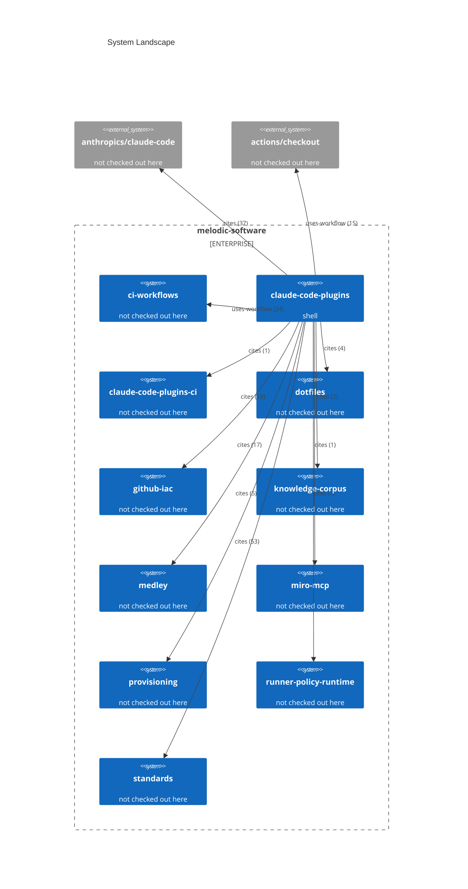

# System Landscape

Generated on 2026-09-10 from current repository plus reference graph. Remote facts: not used.

Every fact traces to the file the probe named. Every edge is typed by the
syntax that carries it and labelled with how many references support it.
A system with no probed runtime is one this checkout names but does not
contain.

63 external repositories are referenced but not drawn; the record carries
every one of them.

## Annotations

Everything above is extracted. Everything here is annotation: the extractor reports
that a repository is referenced and how, never what it is for. Edit this file
freely; the renderer appends it and never overwrites it.

| System | What it is for |
|---|---|
| `claude-code-plugins` | This repository. The plugin marketplace and its skills. |
| `ci-workflows` | The reusable workflows and composite actions every lane here calls. |
| `standards` | The engineering conventions this repository restates and defers to. |
| `github-iac` | GitHub organisation and repository configuration as code. |
| `medley` | An application repository that consumes these plugins. |
| `provisioning` | Machine provisioning. |
| `dotfiles` | Developer environment setup. |
| `knowledge-corpus` | Source material the writing and research skills draw on. |
| `anthropics/claude-code` | The CLI these plugins target. External, read-only. |
| `actions/checkout` | The GitHub Action every workflow here starts with. External, read-only. |

The `cites` counts dwarf every other edge type because this repository is mostly
prose about tooling. A high `cites` count means the two repositories talk about
each other, not that one runs on the other. `uses-workflow` is the edge that
carries a real runtime dependency.
