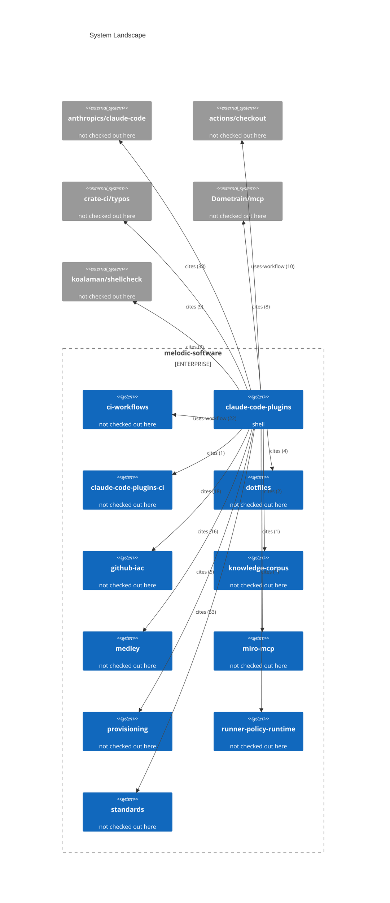

# System Landscape

Generated on 2026-09-19 from current repository plus reference graph. Remote facts: not used.

Every fact traces to the file the probe named. Every edge is typed by the
syntax that carries it and labelled with how many references support it.
A system with no probed runtime is one this checkout names but does not
contain.

66 external repositories are referenced but not drawn; the record carries
every one of them.
