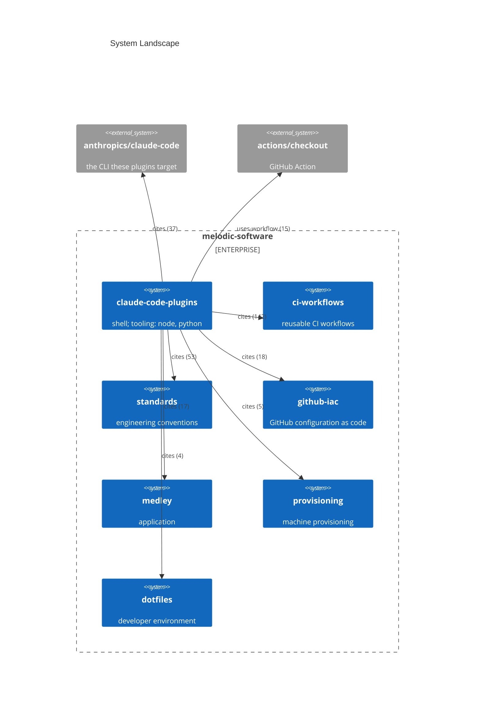

# System Landscape

Generated on 2026-09-10 from this repository plus its reference graph, one hop
out. Facts come from `portfolio-facts.sh`; edges come from `reference-edges.sh`,
which reads tracked files only. Nothing was fetched, so a stale checkout reports
a stale date and a repository this one never names does not appear at all.

Every edge is typed by the syntax that carries it and labelled with how many
references support it. `uses-workflow` is a workflow step this repository runs.
`cites` is the weakest type: a mention in prose, configuration, or a rule.

## What the diagram leaves out

Five further same-owner repositories are referenced once or twice each and are
omitted to keep the diagram readable: `knowledge-corpus` (2), plus
`runner-policy-runtime`, `miro-mcp`, and `claude-code-plugins-ci` (1 each).

Sixty-five external repositories are referenced in total. Only the two most
referenced are drawn. The rest are tool and documentation citations rather than
systems this repository relates to, and they belong in the record instead of the
diagram.

Node descriptions above are annotations, not extracted facts: the extractor
reports that a repository is referenced and how, never what it is for. Only the
`claude-code-plugins` node carries probe-derived runtime and tooling, because it
is the only repository checked out here.
