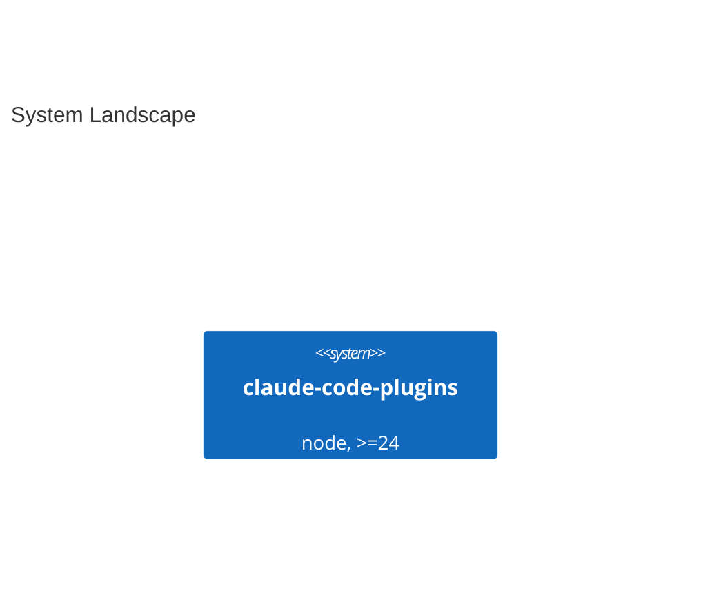

# System Landscape

Generated on 2026-09-08 from an explicit repository list (`--repos`). Every fact
below traces to the file named in `portfolio.md`; nothing was fetched, and the
date reflects the local HEAD of each checkout.

One repository, one owner (`melodic-software`), so no enterprise boundary is
drawn and no relationship line exists: an edge needs a fact in one repository
that names another, and there is no second repository here to name.
