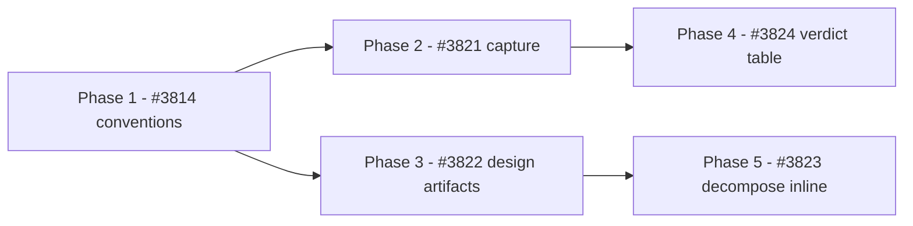

# PLAN. Typed ticket body lane

Container: #3799. Planning slice: #3805. Implementation slices: #3814, #3821, #3822, #3823, #3824.

## Brief

Give the ticket body a type. Acceptance criteria gain an opt-in EARS format and an always-on
unwanted-behaviour coverage prompt. Design gains typed artifact targets per scope. Decompose inlines
those artifacts into slice bodies. Verification returns a per-criterion verdict table when criteria
carry EARS tags. Four skill extensions plus one convention registration. No new plugin, no new skill.

The goal is a planning-to-verification chain where the shape of an acceptance criterion and the shape
of a design artifact are both declared, machine-recognizable, and carried forward into the ticket and
the verdict, instead of free-text prose reinterpreted at each hop.

### Constraints that govern every phase

- Team-shared format choices live in the consumer's convention surface, never in `userConfig`.
- Zero-config behavior is preserved exactly. A consumer with no convention surface sees today's
  behavior, with no prompt and no new output.
- Diagram craft is cited from an installed community diagram skill, presence-gated, never authored
  here.
- Mermaid C4 is experimental and is not offered for the system scope.
- Skill bodies stay org-agnostic. No publisher names, fleet repository names, or organization-scoped
  environment keys.
- Every cross-plugin reference is presence-gated with a stated fallback, per the seam-phrasing
  convention.

## Standards grounding

Loaded for the surfaces this lane touches: `docs/PLUGIN-PHILOSOPHY.md` for the design boundary, the
configuration-ownership doctrine and the convention registry's one-owner-doc rule; the config-cascade
convention for layer order, surface naming and the all-layers-absent valid state; the seam-phrasing
convention for presence-gated references; and the topic-docs convention for where this file lives and
why its sibling `design/` directory needs no index.

## The dependency chain

The chain is a diamond, not a line. Phase 1 gates everything because both downstream branches read
the keys it defines. The two branches never meet again: the tag contract flows down the left, the
artifact contract down the right.

## Phase 1. Register the two conventions. #3814 [TODO]

Create `docs/conventions/authoring-formats/` as the owner document for both keys, add one registry
row per key in `docs/PLUGIN-PHILOSOPHY.md`, and state the resolution rule including the default
returned when every layer is absent.

The owner document declares:

| Key | Allowed values | Default |
|---|---|---|
| acceptance-criteria format | `free-text`, `ears` | `free-text` |
| diagram dialect, data artifacts | `mermaid`, `dbml` | `mermaid` |
| diagram dialect, system artifacts | `likec4`, `c4-plantuml` | `mermaid` is not offered |

The system-scope row has no Mermaid option by design, and the owner document must say why rather than
leaving the omission to be read as an oversight.

The document also names the consumer's declaration surface and defers its layering to the config
cascade rather than restating it. That surface is a file in the consuming repository, not an artifact
of this one; this phase specifies its shape and ships no instance of it.

**Sanity Check:**
- `grep -c 'authoring-formats' docs/PLUGIN-PHILOSOPHY.md` returns 2, one row per key.
- `test -f docs/conventions/authoring-formats/README.md && test -f docs/conventions/authoring-formats/CHANGELOG.md`
- `grep -qi 'free-text' docs/conventions/authoring-formats/README.md && grep -qi 'mermaid' docs/conventions/authoring-formats/README.md`
- `grep -rn 'userConfig' docs/conventions/authoring-formats/README.md` returns nothing.
- `node scripts/validate-plugin-contracts.mjs` exits 0.

## Phase 2. Capture: coverage prompt and EARS tags. #3821 [TODO]

Two changes in `plugins/planning/skills/interview/` and `plugins/planning/skills/prd/`.

Always on, independent of any convention: acceptance-criteria capture asks once whether an
unwanted-behaviour case and a state-driven case are missing. One prompt, not a per-criterion
interrogation, and "neither applies" is a valid answer.

Convention-gated: when the resolved format is `ears`, each emitted criterion carries a bracketed
pattern prefix naming one of the five patterns. When the format is `free-text` or no surface exists,
criteria are emitted exactly as today, untagged.

The tag form is `- [ ] [event-driven] WHEN ...`. It is greppable, it survives being pasted into a
tracker body, and it leaves the checkbox list shape that decompose and the tracker already consume
intact.

Both skills' Boundary sections name Gherkin export as a deferred extension point and build none of it.

**Sanity Check:**
- `grep -qE '\[(ubiquitous|event-driven|state-driven|unwanted-behaviour|optional-feature)\]' plugins/planning/skills/interview/SKILL.md` and the same for `prd`.
- `grep -qi 'gherkin' plugins/planning/skills/interview/SKILL.md` and the same for `prd`.
- Both skills state the untagged default explicitly: `grep -qi 'free-text' plugins/planning/skills/{interview,prd}/SKILL.md`.
- `bash scripts/check-changed-skills.sh main` reports 0 failed.
- `bash scripts/check-changelog-parity.sh --check-bump main` exits 0.

## Phase 3. Design: typed artifact per scope. #3822 [TODO]

In `plugins/planning/skills/design/`, map each scope to one artifact type and emit it in the dialect
the convention names. Data scope emits a data model. Integration scope emits a sequence diagram plus
an OpenAPI 3.1 sketch. System scope emits a C4 container view, never in Mermaid.

Each emitted artifact carries a scope label. That label is the contract Phase 5 reads, and it exists
so artifact-to-slice matching is a lookup rather than an inference over prose. This requirement is
additional to what #3822's own Brief states, and it is recorded in the decisions table below.

Artifacts land in the topic's contract slice beside the design-threads artifact. Mermaid craft is
cited from an installed community diagram skill, presence-gated, with the skill still producing its
artifact when that skill is absent.

**Sanity Check:**
- `grep -qi 'erDiagram' plugins/planning/skills/design/SKILL.md` and `grep -qi 'openapi' ...`.
- The system scope names LikeC4 and C4-PlantUML and excludes Mermaid: `grep -qi 'likec4' ...` and the body states the Mermaid C4 exclusion with its reason.
- The scope label is specified: `grep -qi 'scope label' plugins/planning/skills/design/SKILL.md`.
- The community-skill citation is presence-gated with a fallback, matching `docs/conventions/seam-phrasing/README.md`.
- `bash scripts/check-changed-skills.sh main` reports 0 failed.

## Phase 4. Verification: per-criterion verdict table. #3824 [TODO]

In `plugins/verification/skills/confirm/`, the fresh-context verifier returns one row per criterion
when the retrieved criteria carry EARS tags: criterion, pattern, evidence, verdict. Untagged criteria
return today's narrative form unchanged. No lever, no flag, no key.

`unverifiable` is a first-class verdict and is never rounded into `met`. That is the whole point of
the table: an unchecked criterion currently disappears into narrative prose, and a table makes its
absence visible.

**Sanity Check:**
- The three verdict values are named: `grep -qE 'unverifiable' plugins/verification/skills/confirm/SKILL.md`.
- The table's four columns are named in order.
- The untagged fallback is stated: `grep -qi 'narrative' plugins/verification/skills/confirm/SKILL.md`.
- `grep -c 'userConfig' plugins/verification/skills/confirm/SKILL.md` shows no new key.
- `bash scripts/check-changed-skills.sh main` reports 0 failed.

## Phase 5. Decompose: inline the design artifact. #3823 [TODO]

In `plugins/work-items/skills/decompose/`, widen the existing inline carve-out from pressure-test
output alone to include a design artifact produced for that slice's scope, matched on the scope label
Phase 3 emits. The artifact is inlined as a fenced diagram block followed by a one-line provenance
note naming the producing scope.

No file path appears in the emitted body. Existence of a matching artifact is the entire trigger:
no flag, no lever, no key. When no artifact matches, the slice body is byte-identical in shape to
today's.

**Sanity Check:**
- The carve-out names both admitted inline kinds: `grep -qi 'pressure-test' plugins/work-items/skills/decompose/SKILL.md` and `grep -qi 'design artifact' ...`.
- The no-path rule survives: the emitted-body spec still forbids file paths.
- `grep -qi 'provenance' plugins/work-items/skills/decompose/SKILL.md`.
- `bash scripts/check-changed-skills.sh main` reports 0 failed.

## Test strategy

There is no runtime code here, so the test boundary is not a function signature. Every one of these
skills is instruction text a model executes, and the repository already owns the gates that check
that text: the skill-quality contract gate, markdownlint, the plugin-contract validator, and the
changelog-parity gate. Those are the existing interfaces, and no new one is introduced for
testability.

Behavior that the static gates cannot reach is checked by the phase Sanity Checks above, which are
greps against the shipped text rather than judgments about it. Two behaviors deserve naming because
they are the ones most likely to regress silently:

- **The zero-config path.** Every phase from 2 onward has a Sanity Check asserting the untagged or
  artifact-absent default is still stated in the body. A consumer who never opts in must see no
  change, and that is the criterion most easily lost when the opt-in path is the interesting one.
- **The tag round trip.** Phase 2 writes the tag and Phase 4 detects it. Those are separate PRs on
  separate plugins, so nothing mechanical binds them. The tag grammar is stated identically in both
  bodies, and each phase's Sanity Check greps for the same five pattern names.

## Files affected

| File | Action | Phase |
|---|---|---|
| `docs/conventions/authoring-formats/README.md` | create | 1 |
| `docs/conventions/authoring-formats/CHANGELOG.md` | create | 1 |
| `docs/PLUGIN-PHILOSOPHY.md` | modify, two registry rows | 1 |
| `plugins/planning/skills/interview/SKILL.md` | modify | 2 |
| `plugins/planning/skills/prd/SKILL.md` | modify | 2 |
| `plugins/planning/skills/design/SKILL.md` | modify | 3 |
| `plugins/verification/skills/confirm/SKILL.md` | modify | 4 |
| `plugins/work-items/skills/decompose/SKILL.md` | modify | 5 |
| `plugins/{planning,verification,work-items}/CHANGELOG.md` and `plugin.json` | modify, per touching phase | 2-5 |
| Each touched plugin's `README.md` and skill-listing reference docs | modify | 2-5 |

## Alternatives considered

**Two owner documents instead of one.** Rejected because both keys are one adoption decision a team
makes together, and the registry already shows a single document owning several axes. *Switch
condition:* a consumer needing to set the two keys independently, or a third format key arriving that
shares only one of them.

**Per-plugin convention surfaces.** Rejected because the same key would live in three files and drift
the first time one was updated alone. *Switch condition:* the keys stop being read by more than one
plugin.

**A trailing parenthetical tag instead of a bracketed prefix.** Rejected because criteria prose
routinely contains parentheses, so detection would be ambiguous. *Switch condition:* the prefix is
found to break a tracker's own rendering of a checkbox list.

**Prose matching of design artifact to slice.** Rejected because it fails silently and unmatched
artifacts would simply never appear. *Switch condition:* the scope label proves impossible to thread
through decompose's record without leaking a path into the emitted body.

**Putting the keys in `userConfig`.** Rejected by the configuration-ownership doctrine: these are
team-shared format choices, not per-operator dials. *Switch condition:* the doctrine itself changes.

## Risks and mitigations

**The tag contract spans two plugins with nothing mechanical binding them.** Phase 2 writes tags and
Phase 4 reads them, in separate PRs. A drift in the pattern vocabulary breaks detection silently and
the verdict table simply never appears. *Mitigation:* the five pattern names are stated identically in
both bodies, and both phases' Sanity Checks grep the same list. Phase 4 is sequenced after Phase 2 so
the written form exists before the reader ships.

**Phases 2 and 3 both bump the planning plugin.** They touch different skills but the same
`CHANGELOG.md` and `plugin.json`. Authored in parallel they will conflict on the second merge.
*Mitigation:* author in parallel, merge serially, and expect the second PR to rebase its version bump.
This is a rebase, not a redesign.

**The scope label is new work not in #3822's Brief.** A worker reading only that issue will not build
it, and Phase 5 then has nothing to match on. *Mitigation:* the requirement is recorded in the
decisions table below and must be added to #3822's acceptance criteria before that slice is
dispatched.

**Zero-config regression is invisible.** The opt-in path is where attention goes, so the untagged
default is what breaks. *Mitigation:* every phase from 2 onward carries an explicit default-path
Sanity Check.

## Blast radius

**Blast radius: MEDIUM.** **Stress-test: yes, trigger matched.**

Thirteen files across four plugins plus the philosophy document puts the file count in the MEDIUM
band, and everything here is reversible by `git revert` with four existing automated gates standing
over it, which pulls the rating down. What pulls it back up is that this lane creates a **new
convention**, which the trigger criteria list as an always-stress-test case because a convention
constrains all future work rather than just this change. The consumer surface it defines is also
shared state that other sessions and other repositories will read.

Not CRITICAL: no runtime code, no data migration, no published API, no security surface, and no
external dependency.

## Execution-shape analysis

| Wave | Phases | Rationale |
|---|---|---|
| A | Phase 1 | Gates both branches. Nothing else can start. |
| B | Phase 2, Phase 3 | No dependency between them. File overlap only on the planning plugin's changelog and manifest. |
| C | Phase 4, Phase 5 | Phase 4 needs Phase 2's tag form; Phase 5 needs Phase 3's scope label. Fully disjoint plugins, so genuinely parallel. |

Per-phase routing:

| Phase | Surface | Basis |
|---|---|---|
| 1 | sub-agent worker | Mechanical: a new convention document and two registry rows against a stated shape. |
| 2 | sub-agent worker | Bounded to two skill bodies with an explicit tag grammar. |
| 3 | sub-agent worker | Bounded to one skill body, though the widest judgment call of the five. |
| 4 | sub-agent worker | Bounded to one skill body with a fully specified table. |
| 5 | sub-agent worker | Bounded to one skill body with an explicit trigger rule. |

Cost: four workers across waves B and C rather than five sequential runs. The sequential fallback is
to run the phases in dependency order on one surface, which costs wall-clock time and no correctness.

Every phase is its own PR from `main`, per the container's recorded per-item-PR execution shape.

## Decisions made (gate-passed)

| Decision | What it changes in the plan | Basis |
|---|---|---|
| One owner document under the conventions directory, two registry rows | Phase 1 creates one folder rather than two | Operator chose the conventions directory and asked for consistency with the established approach; the registry's config-cascade row already shows one document owning several axes |
| The consumer's key declaration is not an artifact of this repository | Phase 1 specifies a surface shape and ships no instance | The config-cascade convention places a consumer surface in the consuming repository across three layers |
| Bracketed prefix as the EARS tag form | Fixes the grammar Phase 2 writes and Phase 4 detects | Operator approved; parentheses appear in criteria prose and would make detection ambiguous |
| Design artifacts carry an explicit scope label | Adds a requirement to Phase 3 and gives Phase 5 a lookup | Operator approved the recommendation; prose matching fails silently |
| Phases 2 and 3 authored in parallel, merged serially | Execution shape, wave B | File-overlap matrix shows the only collision is the planning plugin's changelog and manifest |

## Handoff to implementation

Each phase is dispatched with its issue as the spec, this plan as the shared contract, and its own
worktree branched from `main`. Scope fences:

| Phase | Allowed | Forbidden |
|---|---|---|
| 1 | `docs/conventions/authoring-formats/**`, the two registry rows in `docs/PLUGIN-PHILOSOPHY.md` | Any `plugins/**` file |
| 2 | `plugins/planning/skills/{interview,prd}/**`, planning plugin metadata | `plugins/planning/skills/design/**` |
| 3 | `plugins/planning/skills/design/**`, planning plugin metadata | `plugins/planning/skills/{interview,prd}/**` |
| 4 | `plugins/verification/**` | Any other plugin |
| 5 | `plugins/work-items/skills/decompose/**`, work-items plugin metadata | Any other plugin |

`PLAN.md` is edited main-session only. Workers report back rather than editing it.

Before Phase 3 is dispatched, #3822's acceptance criteria must gain the scope-label requirement.
Dispatching it without that leaves Phase 5 with nothing to match on.
