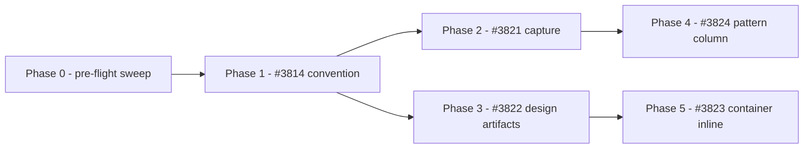

# PLAN. Typed ticket body lane

Container: #3799. Planning slice: #3805. Implementation slices: #3814, #3821, #3822, #3823, #3824.

**Revision 2.** Revision 1 was reviewed by two independent fresh contexts and by upstream research,
and was wrong about where criteria travel. All five slice issues were amended on 2026-09-06 and are
the authoritative specs; this plan carries the shared reasoning, not the requirements.

## What revision 1 got wrong, and why it matters here

Revision 1 assumed acceptance criteria flow from capture, through decompose, into a slice, and are
read back by slice-level verification. They do not. `work-items:decompose` authors fresh criteria per
slice, and that is deliberate: it is inherited near-verbatim from `to-tickets` in `mattpocock/skills`,
whose stated rationale is that a vertical slice "is verifiable alone and owns everything it grades",
unlike horizontal slices whose "acceptance criteria have to reach into work that another ticket owns".
Carrying a Brief's criteria into slices would break that property. Decompose is not changing.

What decompose does carry is the container: it publishes the container body as the Brief verbatim,
acceptance criteria included. And the container has a reader, `/review:quality-gate close-out`, which
judges the container's acceptance criteria and keeps the container open on a `missing` or `wrong`
finding. So a tag written at capture reaches the close-out review, and revision 1 pointed elsewhere.

One qualification, because "exactly one consumer" would be too strong. `verification:confirm` reads
an approved plan's acceptance criteria directly, so in a single-session flow that never decomposes,
tagged criteria do reach it, with no pattern column. That path is out of this lane's scope and is
recorded as a known gap rather than left silent.

Two consequences run through every phase below. The tag's reader is the close-out review, not
slice-level verification. And the artifact's inline target is the container body, which stands
one-to-one with the design session that produced the artifact, rather than a slice, which does not.

## Brief

Give the ticket body a type. Acceptance criteria gain an opt-in EARS format and an always-on
unwanted-behaviour coverage prompt. The design skill types and dialect-selects the per-scope
artifacts it already emits. Decompose inlines the artifact into the container body. The close-out
review's existing acceptance-criteria rollup gains a pattern column when the container's criteria
carry tags.

### Constraints that govern every phase

- Team-shared format choices live in a consumer convention surface, never in `userConfig`.
- **Zero-config is scoped to emitted output.** A consumer with no convention surface sees emitted
  criteria and artifacts unchanged from today. The unwanted-behaviour coverage prompt is deliberately
  outside that guarantee: it is always on, because it is the one part of this lane with reach that
  does not depend on anyone opting in.
- A skill body **restates** the resolution ladder and never defers to `docs/conventions/`. An
  installed plugin cannot read this repository at runtime, and a path citation to it would make the
  publisher a runtime dependency.
- Mermaid C4 is experimental and is not offered for the system scope. That key has no default, so a
  zero-config consumer emits no C4 view.
- Skill bodies stay org-agnostic.
- Every cross-plugin reference names its target and is presence-gated with a stated fallback.

## Standards grounding

Loaded: `docs/PLUGIN-PHILOSOPHY.md` for the design boundary, configuration ownership and the
one-owner-document registry rule; `docs/conventions/config-cascade/README.md` for layer order,
surface naming, the all-layers-absent valid state and the Implementers table as the conformance
record; `docs/conventions/seam-phrasing/README.md` and `docs/conventions/native-references/README.md`
for the two classes of presence-gated reference; `docs/conventions/topic-docs/README.md` for the
contract slice's prune rule; and `docs/conventions/rendered-views/README.md` for the boundary a
diagram-dialect key must state.

## Dependency chain

## Phase 0. Pre-flight consumer sweep [DONE]

Three contracts cross a plugin boundary in this lane: the two convention keys, the EARS tag, and the
scope label. None has a consumer inventory, and revision 1 asserted the checkbox shape was safe for
"decompose and the tracker" without checking.

Produce a written inventory, recorded in this file, of every skill that parses an acceptance-criterion
line or emits a diagram, each with a verdict of unaffected, needs update, or out of scope. Start from
`grep -rl 'acceptance.criteria' plugins/*/skills/*/SKILL.md` and from a search for mermaid emitters,
which includes `plugins/visualization/skills/visualize` and its `rendered-views` surface.

This phase writes no plugin file. It exists so a later phase does not discover a consumer by breaking it.

**Status: done, main-session.** Inventory below.

### Consumer inventory

Fourteen skills reference acceptance criteria; one skill emits mermaid. Verdicts:

| Consumer | Verdict | Why |
|---|---|---|
| `work-items/decompose` | needs update | Phase 5. Owns the container body the artifact inlines into. |
| `work-items/ship` | unaffected | Routes to close-out review; does not itself parse a criterion line. |
| `planning/interview` | needs update | Phase 2. Authors the tagged criteria. |
| `planning/design` | needs update | Phase 3. Emits the artifacts being typed. |
| `verification/confirm` | out of scope, known gap | Reads an approved plan's acceptance criteria, so in a single-session flow that never decomposes it can see tagged criteria with no pattern column. Revision 1 targeted it for the decomposed flow, which was wrong; leaving the single-session flow uncovered is a stated gap, not an oversight. |
| The close-out review path | needs update | Phase 4. The one reader of tagged container criteria. |
| `implementation/implement` | unaffected | Reads criteria as prose to decide done-ness; a bracketed prefix is inert to it. |
| `implementation/implement-dispatch` | unaffected | Passes criteria through; no shape parsing. |
| `work-items/work` | unaffected | Reads a slice's own criteria, which stay untagged. |
| `work-items/triage` | unaffected | Judges intake, not criterion syntax. |
| `session-flow/workflow` | unaffected | Routes stages; no criterion parsing. |
| `plugin-quality/audit` | unaffected | Mentions criteria in prose only. |
| `domain-driven-design/curate-language` | unaffected | Mentions criteria in prose only. |
| `playbooks/boris`, `playbooks/fable-5` | out of scope | Reference documents, not parsers. |
| `visualization/visualize` | needs boundary statement, not a change | The only other mermaid emitter. It routes on a `medium` key owned by `rendered-views`, which is delivery surface rather than source syntax. Phase 1 states the boundary; this skill itself does not change. |

No consumer parses a criterion line strictly enough that a bracketed prefix breaks it. The one real
collision risk was `visualization/visualize`, and it is a boundary-statement problem rather than a
code change.

**Sanity Check:**

- This section contains one row per matched skill with a verdict in every row. Satisfied above.

## Phase 1. Register the authoring-formats convention. #3814 [TODO]

Create `docs/conventions/authoring-formats/` with its README and CHANGELOG, add **one** registry row
in `docs/PLUGIN-PHILOSOPHY.md`, and add one row to the config-cascade Implementers table.

One row, not two. The registry rule is one owner document per shared concern, and its own
config-cascade row already owns four axes in a single row. Revision 1 cited that row as precedent for
two rows, which inverted what it shows.

The document declares the acceptance-criteria key (`free-text` default, `ears`), the data dialect key
(`mermaid` default, `dbml`), and the system dialect key (`likec4`, `c4-plantuml`, **no default**). It
states the resolution ladder in a form a consuming skill restates verbatim: surface path, layer order,
default, soft-degrade, provenance reporting. It states its boundary against `rendered-views` in one
sentence. It carries a four-part upstream-drift stamp on the Mermaid-C4 exclusion.

This phase touches no plugin, so it bumps no version and runs no skill-quality check. #3814's original
criteria demanded those and were dropped in the amendment.

**Sanity Check:**

- `grep -c 'authoring-formats' docs/PLUGIN-PHILOSOPHY.md` returns 1.
- `test -f docs/conventions/authoring-formats/README.md && test -f docs/conventions/authoring-formats/CHANGELOG.md`
- `grep -q 'rendered-views' docs/conventions/authoring-formats/README.md`
- `grep -q 'recheck' docs/conventions/authoring-formats/README.md` (the drift stamp's fourth part)
- `grep -q 'authoring-formats' docs/conventions/config-cascade/README.md` (the Implementers row)
- `! grep -q 'userConfig' docs/conventions/authoring-formats/README.md`
- `npx markdownlint-cli2 'docs/conventions/authoring-formats/*.md' docs/PLUGIN-PHILOSOPHY.md` reports 0 issues.
- `git diff --name-only main...HEAD -- plugins/` is empty.

## Phase 2. Capture: coverage prompt and EARS tags. #3821 [TODO]

Two changes in `plugins/planning/skills/interview/` and `plugins/planning/skills/prd/`, including
their `context/` spokes. The Brief template lives in `interview/context/loop.md`, not in `SKILL.md`,
and revision 1's checks targeted only `SKILL.md`, so they could have passed while the template stayed
untagged.

The coverage prompt is always on and asks once. In a non-interactive run it is skipped and the
returned summary states the coverage went unexamined.

Tags attach to the Brief's **plain-bullet** form, `- [event-driven] WHEN ...`. The Brief template does
not use checkboxes and is not being converted to them.

**Sanity Check:**

- `grep -qE '\[(ubiquitous|event-driven|state-driven|unwanted-behaviour|optional-feature)\]' plugins/planning/skills/interview/context/loop.md`
- All five pattern names appear in `plugins/planning/skills/interview/SKILL.md`, and separately in `plugins/planning/skills/prd/SKILL.md`.
- The non-interactive skip is stated **for the coverage prompt specifically**, not merely somewhere in the file. `interview/SKILL.md` already contains one unrelated `non-interactive` mention, so assert the phrase co-occurs with the prompt: `grep -qi 'unwanted-behaviour' plugins/planning/skills/interview/SKILL.md` and the surrounding paragraph names the skip. For `prd/SKILL.md`, which has no such mention today, `grep -qi 'non-interactive' plugins/planning/skills/prd/SKILL.md` is a valid new-text assertion.
- `grep -qi 'gherkin' plugins/planning/skills/interview/SKILL.md` and separately for `prd`.
- Each body restates the ladder: `grep -qi 'soft-degrade' plugins/planning/skills/interview/SKILL.md` and separately for `prd`.
- `bash scripts/check-changed-skills.sh main` reports 0 failed.
- `bash scripts/check-changelog-parity.sh --check-bump main` exits 0.
- `npx markdownlint-cli2` on the changed files reports 0 issues.

## Phase 3. Design: dialect and scope label on existing artifacts. #3822 [TODO]

`plugins/planning/skills/design/SKILL.md` already ships a Scope-specific artifacts table. This phase
gives those artifacts a declared dialect and a scope label. It introduces no new artifact family, and
revision 1 read as though it did.

`library` and `module` emit no typed artifact and therefore no scope label; the body says so. The
system scope emits nothing when its key is unset.

The diagram-craft citation names its target explicitly and follows the convention governing that
target's class. An unnamed collaborator cannot be presence-gated.

**Sanity Check:**

- `grep -qi 'scope label' plugins/planning/skills/design/SKILL.md`
- `grep -qi 'erDiagram' plugins/planning/skills/design/SKILL.md` and `grep -qi 'openapi' plugins/planning/skills/design/SKILL.md`
- `grep -qi 'likec4' plugins/planning/skills/design/SKILL.md`
- The body names `library` and `module` as emitting no typed artifact.
- **Default path:** `grep -qi 'no C4' plugins/planning/skills/design/SKILL.md`. Verified to return no match on the unmodified tree, so this asserts new text rather than passing for free.
- The citation names a specific target skill, not "a community diagram skill".
- `bash scripts/check-changed-skills.sh main` reports 0 failed.
- `bash scripts/check-changelog-parity.sh --check-bump main` exits 0.
- `npx markdownlint-cli2` on the changed files reports 0 issues.

## Phase 4. Close-out rollup: add a pattern column. #3824 [TODO]

The file is `plugins/review/skills/quality-gate/context/close-out.md`, routed from that skill's
`SKILL.md`. Revision 2 named no file, which was a gap.

**This phase is much smaller than revision 2 assumed, and revision 1 smaller still than that.** The
close-out review already anchors on the container's acceptance criteria, already gives every criterion
a `delivered` / `partial` / `missing` / `unverifiable` verdict, already states that `unverifiable` is
"never quietly folded into `delivered`", and already renders the rollup unconditionally. The premise
that it reports narrative prose and lets an unchecked criterion pass unnoticed is false.

What it lacks is any awareness of a criterion's requirement pattern. This phase adds one conditional
column and changes no judgment.

Two things revision 2 proposed are dropped. A `met` / `not-met` vocabulary would compete with the
existing four-value one for the same judgment. And making `unverifiable` keep the container open would
change a blocking rule that fires today only on `missing` or `wrong`, is co-owned by
`container-lifecycle.md`, and sits outside this phase's fence. When a container closes is a
container-level decision, not a side effect of adding a column.

**Sanity Check:**

- All five pattern names appear in `plugins/review/skills/quality-gate/context/close-out.md`.
- `! grep -qE '\bnot-met\b' plugins/review/skills/quality-gate/context/close-out.md` — no competing vocabulary introduced.
- The existing blocking sentence is untouched: `git diff main...HEAD -- plugins/review/skills/quality-gate/context/close-out.md` contains no change to the line stating that a `missing` or `wrong` finding is a blocker.
- The partial-tagging rule is stated: `grep -qi 'empty pattern cell' plugins/review/skills/quality-gate/context/close-out.md`.
- `git diff --name-only main...HEAD -- plugins/work-items/` is empty.
- `bash scripts/check-changed-skills.sh main` reports 0 failed.
- `bash scripts/check-changelog-parity.sh --check-bump main` exits 0.
- `npx markdownlint-cli2` on the changed files reports 0 issues.

## Phase 5. Decompose: inline the artifact into the container body. #3823 [TODO]

Widen the container body composition, not the slice body. Slice bodies are unchanged.

Inline only what the tracker renders as a diagram. Mermaid renders; DBML, OpenAPI, LikeC4 and
C4-PlantUML do not, so those are inlined as plain fenced blocks whose provenance note names the
dialect, so a reader knows what they are looking at.

No file path appears in any emitted body. The contract slice is pruned before merge, so a path would
dangle by construction.

**Sanity Check:**

- The change lands in `plugins/work-items/skills/decompose/context/container-lifecycle.md`, not in the slice template: `git diff --name-only main...HEAD -- plugins/work-items/skills/decompose/SKILL.md` is empty.
- The Body bullet states the inlined artifact as an explicit exception to its own no-inflation rule: `grep -qi 'no inflation' plugins/work-items/skills/decompose/context/container-lifecycle.md` still matches, and the same bullet now names the artifact exception.
- **Artifact-absent path:** the file states the container body is unchanged when no artifact exists.
- The provenance note's required contents are stated by name: `grep -qi 'dialect' plugins/work-items/skills/decompose/context/container-lifecycle.md`.
- The no-path rule is still stated in the emitted-body spec.
- `bash scripts/check-changed-skills.sh main` reports 0 failed.
- `bash scripts/check-changelog-parity.sh --check-bump main` exits 0.
- `npx markdownlint-cli2` on the changed files reports 0 issues.

## Test strategy

No runtime code. The test boundary is the repository's existing gates: the skill-quality contract
gate, markdownlint, the plugin-contract validator, and the changelog-parity gate. No new interface is
introduced for testability.

Every phase's Sanity Checks are greps against shipped text rather than judgments about it. Revision 1
carried checks that were not executable, and they are fixed here: brace expansion inside a quoted path
does not expand in PowerShell or in `dash`, so each path is written out; `grep -c` prints `0` but
**exits 1** on zero matches, so it fails under `set -e` exactly when the absence it was checking
holds, and absence is now checked with `! grep -q`; and several checks passed on the unmodified tree,
so they were re-pointed at new text and the ones asserting absence were verified against the current
tree first.

One check deliberately asserts a *non-change*: Phase 4 must not alter the close-out's existing
blocking sentence, so it greps the diff rather than the file. A check that reads only the final state
cannot tell a preserved line from a rewritten one.

Two behaviours are most likely to regress silently and each has an explicit check. The **zero-config
path**, which every phase from 2 onward asserts, because the opt-in path is where attention goes. And
the **tag vocabulary**, written in Phase 2 and matched in Phase 4 across separate plugins with nothing
mechanical binding them; both phases assert the same five names, and the names are written into both
issue bodies so a worker who never reads this file still has them.

## Files affected

| File | Action | Phase |
|---|---|---|
| `docs/conventions/authoring-formats/README.md`, `CHANGELOG.md` | create | 1 |
| `docs/PLUGIN-PHILOSOPHY.md` | modify, one registry row | 1 |
| `docs/conventions/config-cascade/README.md` | modify, one Implementers row | 1 |
| `plugins/planning/skills/interview/SKILL.md` and `context/loop.md` | modify | 2 |
| `plugins/planning/skills/prd/SKILL.md` and its criteria spoke | modify | 2 |
| `plugins/planning/skills/design/SKILL.md` | modify | 3 |
|  `plugins/review/skills/quality-gate/context/close-out.md` | modify | 4 |
| `plugins/work-items/skills/decompose/context/container-lifecycle.md` | modify | 5 |
| Touched plugins' `CHANGELOG.md`, `plugin.json`, `README.md` | modify | 2-5 |

## Alternatives considered

**Change decompose to carry Brief criteria into slices.** Rejected on upstream evidence: the
fresh-criteria design is inherited with a stated rationale, and carrying criteria down breaks the
property that a slice owns everything it grades. *Switch condition:* the close-out review proves an
inadequate reader in practice, so per-slice grading of Brief criteria becomes necessary.

**Target slice-level verification for the verdict table.** Rejected because slices carry their own
criteria, so the detector would never fire. *Switch condition:* decompose starts carrying tagged
criteria into slices.

**Inline the design artifact into slice bodies.** Rejected because design scope is architectural and a
slice is vertical, so there is no join. *Switch condition:* slices gain a scope attribute.

**Two owner documents, or two registry rows.** Rejected against the registry's own one-document rule
and the config-cascade row's shape. *Switch condition:* the two keys stop being one adoption decision.

**A trailing parenthetical tag.** Rejected because criteria prose contains parentheses. *Switch
condition:* a bundled tracker renders `[text]` as link syntax, which would break the prefix.

## Risks and mitigations

**The tag vocabulary spans two plugins in separate PRs.** *Mitigation:* the five names are written
into both issue bodies, not only into this plan, and both phases assert them.

**Workers cannot read this file.** It is contract-tier, committed on the planning branch and pruned
before merge, and the topic-docs visibility matrix marks contract-tier content absent from a worktree
cut from the default branch. *Mitigation:* every contract a worker needs, the tag grammar, the five
pattern names, the scope label, the ladder requirement, now lives in the amended issue bodies. This
plan is main-session reasoning, not the worker's source of truth.

**Phases 2 and 3 collide on planning plugin metadata.** They share `CHANGELOG.md`, `plugin.json` and
`README.md`, and `scripts/check-stale-base-overlap.sh` is a hard `exit 1` on overlap, not a soft
warning. *Mitigation:* author in parallel, merge serially, and rebase the second onto the first before
it can go green. This is a rebase, not a redesign, but it does block rather than warn.

**This plan cannot merge to main.** `scripts/check-contract-slice-prune.sh --check-diff` red-lines any
path left under `docs/topics/`. *Mitigation:* the planning branch is not merged; the plan is published
to the PR description and the slice pruned, per the close-out ritual.

## Blast radius

**Blast radius: MEDIUM.** **Stress-test: run, and it changed the plan.**

Roughly fourteen files across three plugins plus two convention documents. Everything is reversible by
`git revert`, with four automated gates over it. What raises it is that the lane creates a **new
convention**, which the trigger criteria list as an always-stress-test case because a convention
constrains all future work rather than only this change.

The stress-test was not a formality here. Two independent reviews and one upstream research pass
returned a RETHINK verdict against revision 1, and the correction moved two of the five phases onto
different surfaces. Not CRITICAL: no runtime code, no data migration, no published API, no security
surface, no external dependency.

## Execution-shape analysis

| Wave | Phases | Rationale |
|---|---|---|
| A | Phase 0, Phase 1 | Phase 0 writes no plugin file and can run alongside Phase 1. |
| B | Phase 2, Phase 3 | Independent in content; collide on planning plugin metadata, so serial merge. |
| C | Phase 4, Phase 5 | Disjoint plugins, genuinely parallel. |

Per-phase routing: every phase is a sub-agent worker, each bounded to one issue's spec, its own
worktree from `main`, and its own PR, per the container's recorded per-item-PR shape. Phase 0 is the
exception and stays main-session, because its output is a judgment recorded in this file.

Sequential fallback: run phases in dependency order on one surface. Costs wall-clock, not correctness.

## Decisions made (gate-passed)

| Decision | What it changes in the plan | Basis |
|---|---|---|
| Decompose is not changed | No phase touches slice criteria authorship | Upstream research: the behaviour is inherited from `to-tickets` with the stated rationale that a slice owns everything it grades |
| The verdict table targets close-out review | Phase 4 retargeted, #3824 retitled and amended | `container-lifecycle.md` states close-out judges the container's acceptance criteria; slices carry fresh criteria |
| The artifact inlines into the container body | Phase 5 retargeted, #3823 retitled and amended | Design scope is architectural, a slice is vertical; the container is one-to-one with the design session |
| One registry row | Phase 1 check asserts 1, not 2 | The registry's own config-cascade row owns four axes in a single row |
| The system dialect key has no default | Phase 1 and Phase 3 emit no C4 view under zero-config | A default would make a consumer who never opted in start emitting a view they did not ask for |
| Phase 0 added | A pre-flight consumer sweep now gates the lane | Three contracts cross a plugin boundary and none had a consumer inventory |

## Handoff to implementation

Each phase is dispatched with its amended issue as the spec and its own worktree from `main`. The
issue, not this file, is the worker's contract. Scope fences:

| Phase | Allowed | Forbidden |
|---|---|---|
| 1 | `docs/conventions/authoring-formats/**`, one row in `docs/PLUGIN-PHILOSOPHY.md`, one row in `docs/conventions/config-cascade/README.md` | Any `plugins/**` file |
| 2 | `plugins/planning/skills/interview/**`, `plugins/planning/skills/prd/**`, planning plugin metadata | `plugins/planning/skills/design/**` |
| 3 | `plugins/planning/skills/design/**`, planning plugin metadata | `plugins/planning/skills/{interview,prd}/**` |
| 4 | The close-out review's own plugin tree | Any other plugin |
| 5 | `plugins/work-items/skills/decompose/**`, work-items plugin metadata | Any other plugin |

`PLAN.md` is edited main-session only. Workers report back rather than editing it.
