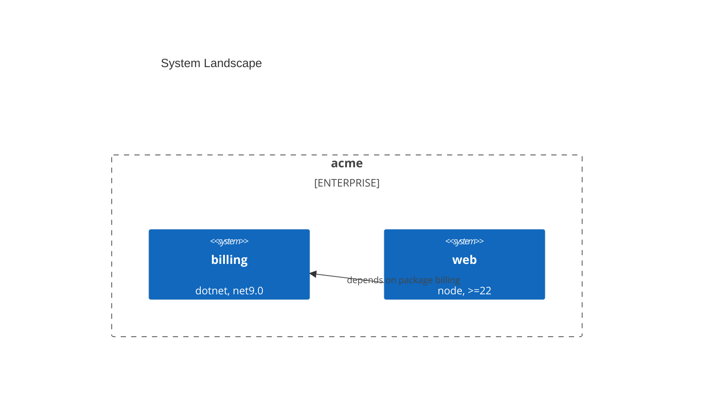

## Repository context

The repository context here is the CONSUMER repository, the one whose convention home declares where
artifacts land. It is never a discovery scope: the set of repositories to chart comes from arguments
only, and the session's working directory is never scanned.

Collect with an **individual** Bash call, one command per call: the project root,
`git rev-parse --show-toplevel`. Treat a failure (not a repository, git unavailable) as an unknown
value and carry on; `${CLAUDE_PROJECT_DIR}` is the resolver's `--root` either way.

## Purpose

Answer "what systems does this organization have, who owns them, what do they run on, and how do
they relate" with two artifacts written into the consumer's declared architecture home: a C4 System
Landscape view, and an application-portfolio table. Every fact traces to a named file; every
relationship traces to a matched string.

## Resolve home and dialect

Read `${CLAUDE_PLUGIN_ROOT}/reference/config.md` first; it owns the keys, the topic-doc location,
and the resolution order. This skill reports against that contract rather than restating it.

Run `bash "${CLAUDE_PLUGIN_ROOT}/lib/resolve-convention-home.sh" --root "${CLAUDE_PROJECT_DIR}"` and
follow the exit code. Never parse the root instruction file yourself.

- **Exit 0**: read `<home>/architecture/README.md` for `architecture_dir` and `landscape_dialect`.
- **Exit 1** (no pointer line), **exit 3** (FAIL, surface the resolver's own message), **exit 2**
  (usage): there is no declared home to read.

Then, per key:

1. **Topic doc.** A declared value wins.
2. **Infer, and propose.** An existing `*.dsl` in the repository proposes `structurizr`; an existing
   `docs/architecture/` or `architecture/` proposes that directory. Inference PROPOSES; only the
   operator's confirmation binds.
3. **Ask once.**
4. **Default.** `landscape_dialect` falls back to `mermaid`. `architecture_dir` has no default:
   undeclared and unconfirmed, including every non-interactive run, STOP and point at
   `/architecture:setup`.

This skill never writes the consumer's root instruction file. `/architecture:setup apply` owns that.

## Discover repositories

The argument selects the mode.

1. **`--repos <path>[,<path>...]`**: exactly those repositories. No discovery runs at all.
2. **`--root <dir>`** (repeatable): discovery.
   - **When the `repo-fleet-hygiene` plugin is installed**, it owns bounded fleet discovery and
     canonical-checkout resolution. Resolve the memory slice per
     `${CLAUDE_PLUGIN_ROOT}/reference/topic-docs.md`, `mkdir -p` it, then invoke via the Skill tool:
     `/repo-fleet-hygiene:audit <root>... --plan-file <memory_dir>/<topic-slug>/fleet-plan.json`.
     Confirm the plan's `schema_version` is `1`, read `repositories[]`, and **keep only entries
     whose `discovered` path lies under a requested root**: that collaborator's config-supplied
     scope is additive, so an unfiltered read would chart the operator's whole configured fleet.
     Use each kept entry's `canonical` and `remote`. Announce that the collaborator's audit collects
     GitHub evidence and may need `gh` authentication.
   - **When the plugin is absent, or the plan file is missing or carries another `schema_version`**:
     fall back to the bundled walk, and ANNOUNCE the fallback. Recurse from each root to depth 5; a
     `.git` entry marks a repository and is not descended into; skip `node_modules`, `vendor`, and
     `.venv`; the canonical checkout is the first record of `git worktree list --porcelain`.
3. **Neither argument**: STOP and name both forms. Never scan the session's working directory.

## Collect facts

Facts come from the helper script, never derived by hand:

```bash
"${CLAUDE_SKILL_DIR}/scripts/portfolio-facts.sh" <repo-path>...
```

The `${CLAUDE_SKILL_DIR}` anchor matters. A bare relative path resolves against the session's working
directory, which is not where the script lives.

It emits one JSON object per repository: `name`, `path`, `remote`, `owner`, `runtime`,
`target_framework`, `dependencies[]`, `last_touched`, `evidence{}`. Anything no probe could derive is
the literal `unknown`. Carry `unknown` through to the artifacts as-is; never replace it with a guess,
and never fill it from a commit author, a directory name, or ecosystem memory.

## Draw relationships

Relationships are your judgment, but every edge cites evidence. An edge A to B exists ONLY when a
fact in A names B:

- a dependency name equals B's repository name or package id;
- a `ProjectReference` or workspace path resolves into B;
- B's remote URL appears in A's tracked config or README.

The edge description is the matched string. No cited match, no edge. Do not infer an edge from
naming similarity, shared owner, or adjacent directories.

## Emit artifacts

Both land in `<architecture_dir>`.

**Artifact one, the landscape.** With `landscape_dialect: structurizr`, write `landscape.dsl`:

```text
workspace {
  model {
    billing = softwareSystem "billing"
    web = softwareSystem "web"
    web -> billing "depends on package billing"
  }
  views {
    systemLandscape "landscape" {
      include *
      autoLayout
    }
  }
}
```

With `landscape_dialect: mermaid`, write `landscape.md`: a `C4Context` block titled "System
Landscape" with no focal system, every repository a `System`, grouped by `Enterprise_Boundary` per
remote owner when more than one owner is present, and `Rel` lines per the evidence rule above:

````markdown

````

**Artifact two, `portfolio.md`.** A heading, a generated-on line carrying the date AND the discovery
source (explicit list / fleet-hygiene plan / bundled walk), then one table:

`Repository | Owner | Target framework | Runtime | Dependencies | Last touched (local HEAD)`

One row per repository, sorted by name. Render `unknown` as-is. Comma-join dependencies, truncating
to 10 with a trailing `(+N)`.

## What this skill does NOT do

- Baseline-versus-target gap analysis, capability maps, or work-breakdown structures.
- Container-level or component-level C4 views. This is the landscape altitude only.
- Modify any discovered repository. Every read is local; nothing fetches, checks out, or writes
  outside `<architecture_dir>`.
- Write the consumer's root instruction file, inside or outside the marked region. That is
  `/architecture:setup apply`.
- Invent a home. No declared and no confirmed `architecture_dir` is a stop, not a default.

## Gotchas

- **The two dialects are not symmetric, and mermaid is the loose one.** Structurizr has a dedicated
  `systemLandscape` view type. Mermaid has no landscape diagram type at all, so the mermaid output
  is a `C4Context` diagram used without a focal system. Upstream also marks its C4 support
  experimental and warns the syntax may change (source: <https://mermaid.js.org/syntax/c4.html>,
  verified 2026-09-06). Recheck this entry when a mermaid release adds a landscape type or drops the
  experimental notice.
- **`owner` is a ladder, and commit authors are not on it.** `CODEOWNERS` (root, `.github/`, or
  `docs/`) default `*` rule's first owner, then the owner segment of the `origin` remote URL, then
  `unknown`. Who edits a repository most is not who owns it, so the script never looks at git
  authorship and neither should the write-up.
- **`last_touched` is local HEAD, and nothing fetches.** A stale checkout reports a stale date. Say
  so in the generated-on line rather than implying the fleet was queried live.
- **The fleet plan is a temp artifact.** `fleet-plan.json` lives in the memory slice of the
  topic-docs convention, which self-ignores. It is never committed and never treated as a durable
  record of the fleet.
- **The plan's repository list is wider than the roots you asked for.** The collaborator's
  config-supplied scope is additive. Filter `repositories[]` on `discovered` before charting, or the
  landscape quietly grows to the operator's whole configured fleet.
