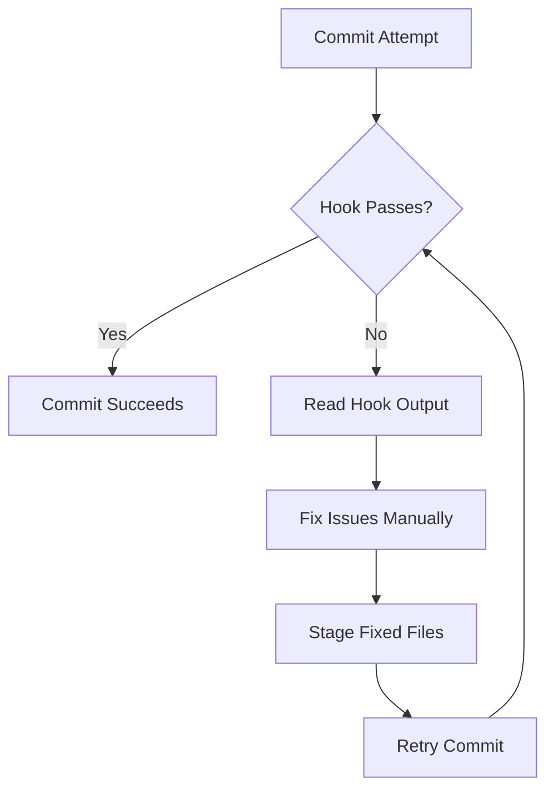
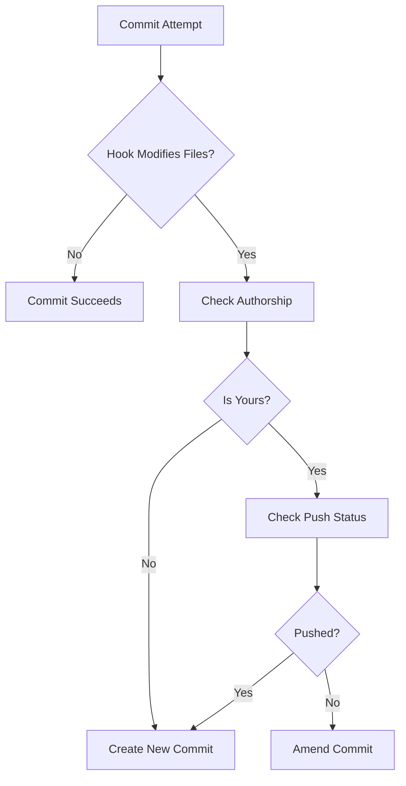

# Pre-Commit Hook Handling

Complete guidance for handling pre-commit hook failures, modifications, and retry logic.

## Overview

Pre-commit hooks are automated scripts that run before a commit is created. They enforce code quality standards (linting, formatting, tests) and can either:

1. **Fail the commit** - Report errors and abort
2. **Modify files** - Auto-fix issues and stage changes
3. **Pass silently** - Allow commit to proceed

This document covers how to handle each scenario correctly and safely.

## Table of Contents

- [Overview](#overview)
- [What Are Pre-Commit Hooks?](#what-are-pre-commit-hooks)
  - [Common Pre-Commit Hooks](#common-pre-commit-hooks)
  - [Hook Behavior Types](#hook-behavior-types)
- [Handling Hook Failures (Type 1: Fail-Only)](#handling-hook-failures-type-1-fail-only)
- [Handling Auto-Fix Hooks (Type 2: Files Modified)](#handling-auto-fix-hooks-type-2-files-modified)
- [Complete Hook Handling Protocol](#complete-hook-handling-protocol)
- [Common Hook Scenarios](#common-hook-scenarios)
- [Why These Rules Exist](#why-these-rules-exist)
- [Troubleshooting](#troubleshooting)
- [Best Practices](#best-practices)

## What Are Pre-Commit Hooks?

### Common Pre-Commit Hooks

**Linting**:

- ESLint (JavaScript/TypeScript)
- Pylint/Flake8 (Python)
- RuboCop (Ruby)
- golangci-lint (Go)

**Formatting**:

- Prettier (JavaScript/TypeScript/JSON/Markdown)
- Black (Python)
- rustfmt (Rust)
- gofmt (Go)

**Testing**:

- Quick unit tests (< 10 seconds)
- Type checking (TypeScript, mypy)
- Compilation checks

**Security**:

- Secret detection (detect-secrets, git-secrets)
- Dependency vulnerability scanning

### Hook Behavior Types

#### Type 1: Fail-Only Hooks

**Behavior**: Report errors but don't modify files.

**Example**: ESLint with no auto-fix

```text
❌ src/auth/login.ts
  15:10  error  'token' is assigned a value but never used  @typescript-eslint/no-unused-vars

✖ 1 problem (1 error, 0 warnings)
```

**Response**: Fix errors manually, stage, retry.

#### Type 2: Auto-Fix Hooks

**Behavior**: Automatically fix issues and modify files.

**Example**: Prettier formatting

```text
✔ src/auth/login.ts - formatted
✔ src/auth/token-refresh.ts - formatted

Files modified: 2
```

**Response**: Stage modified files, amend or create new commit (with safety checks).

#### Type 3: Pass-Through Hooks

**Behavior**: Check passes, no action needed.

```text
✔ All checks passed
```

**Response**: Commit succeeds normally.

## Handling Hook Failures (Type 1: Fail-Only)

### Workflow



### Example: ESLint Failure

**Initial commit attempt**:

```bash
git commit -m "$(cat <<'EOF'
feat(auth): add token validation
...
EOF
)"
```

**Hook output**:

```text
❌ Pre-commit hook failed:

src/auth/validate.ts
  10:5  error  'validateToken' is defined but never used  @typescript-eslint/no-unused-vars
  15:3  error  Expected === and instead saw ==  eqeqeq

✖ 2 problems (2 errors, 0 warnings)
```

**Response**:

1. **Read output carefully** - Understand what errors occurred
2. **Fix errors manually**:

   ```typescript
   // Remove unused function
   // Change == to ===
   if (token === null) { ... }
   ```

3. **Stage fixed files**:

   ```bash
   git add src/auth/validate.ts
   ```

4. **Retry commit**:

   ```bash
   git commit -m "$(cat <<'EOF'
   feat(auth): add token validation
   ...
   EOF
   )"
   ```

**DO NOT**:

- ❌ Use `--no-verify` to skip hooks
- ❌ Ignore errors and try to work around them
- ❌ Disable hooks globally

## Handling Auto-Fix Hooks (Type 2: Files Modified)

### The Amend Decision

When hooks modify files, you must decide: **amend or new commit?**

**Critical rule**: Only amend if BOTH safety checks pass.

### Safety Check Protocol

```bash
# Safety Check 1: Verify authorship (must be YOUR commit)
git log -1 --format='%an %ae'
# Expected: Your Name <your@email.com>

# Safety Check 2: Verify not pushed (must be local only)
git status
# Expected: "Your branch is ahead of 'origin/main' by 1 commit"
```

**Decision matrix**:

| Authorship | Pushed | Action |
| ---------- | ------ | ------ |
| ✅ Yours | ❌ Not pushed | ✅ AMEND |
| ❌ Not yours | ❌ Not pushed | ❌ NEW COMMIT |
| ✅ Yours | ✅ Pushed | ❌ NEW COMMIT |
| ❌ Not yours | ✅ Pushed | ❌ NEW COMMIT |

**Rule**: Only amend if top-left cell (yours + not pushed).

### Workflow for Auto-Fix Hooks



### Example: Prettier Auto-Fix

**Initial commit attempt**:

```bash
git commit -m "$(cat <<'EOF'
feat(auth): add token refresh
...
EOF
)"
```

**Hook output**:

```text
✔ src/auth/token-refresh.ts - formatted
✔ src/auth/login.ts - formatted

Files were modified by pre-commit hooks.
Please review, stage, and try again.
```

**Step 1: Check if files were modified**:

```bash
git diff
```

**Output shows formatting changes** (whitespace, semicolons, etc.).

**Step 2: Run safety checks**:

```bash
# Check 1: Authorship
git log -1 --format='%an %ae'
# Output: Your Name <your@email.com>  ✅

# Check 2: Push status
git status
# Output: Your branch is ahead of 'origin/main' by 1 commit  ✅
```

Both checks pass ✅ → Safe to amend

#### Step 3: Amend commit

```bash
# Stage formatted files
git add .

# Amend without changing message
git commit --amend --no-edit
```

**Result**: Formatting fixes included in original commit, preserving history linearity.

### Example: Hook Modified, But Unsafe to Amend

**Scenario**: Last commit was made by a teammate.

**Step 1: Safety check fails**:

```bash
git log -1 --format='%an %ae'
# Output: Jane Doe <jane@example.com>  ❌ Not yours
```

**Step 2: Create new commit instead**:

```bash
# Stage formatted files
git add .

# Create NEW commit (don't amend)
git commit -m "$(cat <<'EOF'
chore: apply automated formatting fixes

Pre-commit hooks applied automatic formatting changes.

🤖 Generated with [Claude Code](https://claude.com/claude-code)

Co-Authored-By: Claude <noreply@anthropic.com>
EOF
)"
```

**Why**:

- Amending someone else's commit changes authorship attribution
- Creates confusion about who made what changes
- Violates audit trail integrity

## Complete Hook Handling Protocol

### When Commit Fails Due to Hooks

```bash
# Step 1: Check if files were modified
git diff

# If NO modifications:
#   → Hook failed with errors only
#   → Fix errors manually
#   → Stage fixed files: git add .
#   → Retry commit

# If YES modifications:
#   → Hook auto-fixed issues
#   → Proceed to Step 2
```

### Step 2: Decide Amend vs New Commit

```bash
# Safety Check 1: Authorship
git log -1 --format='%an %ae'

# Safety Check 2: Push status
git status | grep "ahead of"

# If BOTH checks pass:
#   ✅ git add .
#   ✅ git commit --amend --no-edit

# If EITHER check fails:
#   ✅ git add .
#   ✅ git commit -m "chore: apply automated linting fixes..."
```

### Complete Example Script

```bash
#!/bin/bash

# Attempt commit
git commit -m "$(cat <<'EOF'
feat(auth): add token refresh
...
EOF
)"

# If commit failed, check for modifications
if [ $? -ne 0 ]; then
    # Check if files were modified
    if [ -n "$(git diff)" ]; then
        echo "Hook modified files. Running safety checks..."

        # Check authorship
        AUTHOR=$(git log -1 --format='%ae')
        CURRENT_USER=$(git config user.email)

        # Check push status
        PUSH_STATUS=$(git status | grep "ahead of")

        if [ "$AUTHOR" == "$CURRENT_USER" ] && [ -n "$PUSH_STATUS" ]; then
            echo "✅ Safe to amend"
            git add .
            git commit --amend --no-edit
        else
            echo "❌ Not safe to amend - creating new commit"
            git add .
            git commit -m "chore: apply automated linting fixes"
        fi
    else
        echo "❌ Hook failed with errors - fix manually and retry"
    fi
fi
```

## Common Hook Scenarios

### Scenario 1: ESLint Fails with Errors

**Hook output**:

```text
❌ 5 errors found
```

**Action**:

1. Read errors
2. Fix manually
3. Stage: `git add .`
4. Retry commit

**NO amending** - Just retry original commit.

### Scenario 2: Prettier Formats Files

**Hook output**:

```text
✔ 3 files formatted
```

**Action**:

1. Check safety (authorship + push status)
2. If safe: `git commit --amend --no-edit`
3. If not safe: New commit with "chore: apply formatting"

### Scenario 3: Tests Fail

**Hook output**:

```text
❌ Test suite failed
  ● Auth › validateToken › should reject expired tokens
    expect(received).toBe(expected)
```

**Action**:

1. Fix failing tests
2. Stage: `git add .`
3. Retry commit

**NO amending** - Just retry original commit.

### Scenario 4: Mixed (Errors + Auto-Fixes)

**Hook output**:

```text
⚠️ 2 files formatted automatically
❌ 1 error requires manual fix
```

**Action**:

1. Fix manual errors first
2. Stage all: `git add .`
3. Retry commit
4. If it succeeds but modified files, THEN consider amending

**Order matters**: Fix errors before considering amend.

## Why These Rules Exist

### Why Check Authorship?

**Problem**: Amending someone else's commit changes git attribution.

**Consequence**:

- Git history shows you as author of their work
- Breaks audit trail ("who wrote this line?")
- Violates team attribution policies

**Example**:

```bash
# Original commit by Jane
git log -1
# Author: Jane Doe <jane@example.com>

# You amend it
git commit --amend --no-edit

# Now shows as your commit
git log -1
# Author: Your Name <your@email.com>  ❌ WRONG
```

### Why Check Push Status?

**Problem**: Amending pushed commits rewrites public history.

**Consequence**:

- Breaks everyone's local repositories
- Causes merge conflicts for team members
- Violates shared branch policies

**Example**:

```bash
# You push commit
git push origin main

# Teammate pulls it
cd ../teammate-repo && git pull

# You amend and force push
git commit --amend --no-edit
git push --force

# Teammate's repo is now broken
cd ../teammate-repo && git pull
# Error: Your branch and 'origin/main' have diverged
```

### Why Never Skip Hooks?

**Problem**: Hooks enforce team quality standards.

**Consequence**:

- Inconsistent code quality
- Broken builds in CI/CD
- Team frustration with preventable issues

**Using `--no-verify` creates technical debt**.

## Troubleshooting

### Issue: Amend Changes Commit Authorship

**Cause**: Amended commit now shows your name instead of original author.

**Solution**:

```bash
# Undo amend (soft reset to previous commit)
git reset --soft HEAD@{1}

# Create new commit instead
git commit -m "chore: apply automated fixes"
```

### Issue: Hook Keeps Failing After Fixes

**Cause**: Hook configuration issue or persistent error.

**Solution**:

1. Run hook script manually to see detailed output:

   ```bash
   .git/hooks/pre-commit
   ```

2. Check hook configuration (`.pre-commit-config.yaml`, `package.json`, etc.)
3. Update hook tools to latest versions
4. If truly broken, temporarily disable to fix:

   ```bash
   # Fix broken hook
   git commit --no-verify -m "fix: repair pre-commit hook"

   # Re-enable immediately
   git config core.hooksPath .git/hooks
   ```

### Issue: Unsure if Safe to Amend

**Solution**: When in doubt, create new commit.

```bash
# If uncertain, always create new commit
git add .
git commit -m "chore: apply automated changes from pre-commit hooks"
```

**New commits are always safer than amending**.

## Best Practices

- ✅ **Read hook output carefully** - Understand what failed and why
- ✅ **Fix issues properly** - Don't work around errors
- ✅ **Run safety checks** - Always verify before amending
- ✅ **Create new commit when uncertain** - Safer than amending
- ✅ **Keep hooks enabled** - They exist for good reasons
- ❌ **Never use --no-verify** - Fix issues instead of bypassing
- ❌ **Never amend without safety checks** - Risk breaking team workflow
- ❌ **Never ignore hook errors** - They indicate real problems

---

**Last Verified:** 2025-11-25
**Related**: safety-protocol.md, workflow-steps.md
