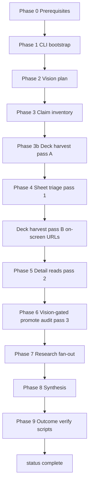

# YouTube watch workflow

Ordered phases for `/knowledge:youtube-digest watch`. **Checkbox surface:** `templates/watch-checklist.md` (materialized to slice `run-state/watch-checklist.md`). **Criteria:** `quality-gates.md`. **Epic queue (optional):** `context/watch-queue.md` — `queue` / `watch` without URL before phase 0.

## Flow

## Phase summary

| # | Goal | Key outputs |
| --- | --- | --- |
| 0 | Toolchain ready | deps, yt-dlp, ffmpeg, magick |
| 1 | Deterministic extraction | `source/transcript.txt`, `run-state/watch.json`, `key-frames/selection.json`, tempSession |
| 2 | Scope vision work | `key-frames/vision-plan.md` |
| 3 | Landscape before research | `research/claim-inventory.md`, `research/research-agenda.md` |
| 3b | Deck harvest pass A | `source/deck-inventory.md`, `source/decks/`, typed `harvested-links.json` |
| 4 | Triage every contact sheet (deck inventory in context) | `key-frames/frame-triage-log.md` |
| 4b | Deck harvest pass B | Re-fetch + re-filter after on-screen deck URLs |
| 5 | Read kept frames | `key-frames/visual-frames.md` |
| 6 | Vision-gated promote + audit | `key-frames/frames/`, manifest, audit, `research/sources.md` |
| 7 | Verify claims | `RESEARCH.md`, `research/findings/` |
| 8 | Repo menu + handoff | applicability, takeaways, interview-handoff |
| 9 | Prove outcomes | `verification/<ISO-basic>Z-watch-outcomes.md` PASS |

## Parallelism (after phase 1)

Like `course-digest` Phase 3: transcript claims, visual triage, and link harvest can fan out in parallel **after** vision-plan and claim-inventory exist. Research and synthesis stay sequential.

## Resume

Read slice `watch-checklist.md` + `watch.json` phase map. Re-run `init-watch-checklist.js` only if sheet count changed. Continue from first unchecked blocking phase.
