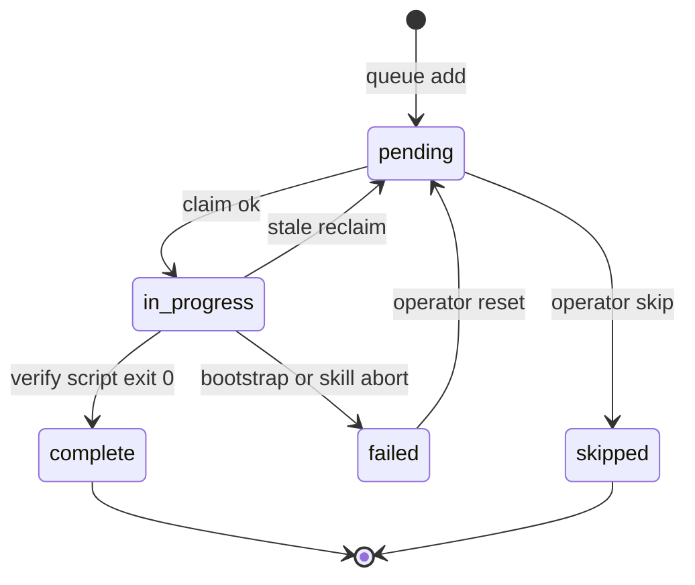

# YouTube watch queue

Epic-level durable queue for batching public YouTube URLs before `/knowledge:youtube watch`. **V1 = markdown table + filesystem claim stubs** — no JSON queue schema.

## Artifacts

| Path | Role |
| --- | --- |
| `.work/<watch-epic>/QUEUE.md` | Human-readable queue table (live) |
| `.work/<watch-epic>/claims/<n>.json` | Row-level exclusive claim (concurrency only) |
| `templates/queue.md` | Empty table copied on first `queue` use |

Per-video work stays under `.work/<watch-epic>/<video-slug>/` (`watch.json`, slices). The queue answers **which URL next** — not phase internals.

## Table columns

| Column | Meaning |
| --- | --- |
| `#` | 1-based row index (stable after insert; do not renumber on complete) |
| `URL` | Canonical YouTube URL |
| `video-id` | From `extractVideoId` — dedupe key |
| `title` | Video title from the preflight probe (escaped + 60-char capped) — so the row is legible without opening the URL |
| `channel` | `Display Name (@handle)` from the preflight probe |
| `slug` | Filled after first bootstrap (`derive-video-slug.js`); may be pre-filled at queue time when companion brief materialized |
| `status` | `pending` \| `in_progress` \| `complete` \| `failed` \| `skipped` |
| `notes` | Operator/agent notes (terminal label, error one-liner, or `companion — source/companion-sources.md`) |

Claim metadata (`claimedAt`, `claimedBy`) lives in `claims/<n>.json` — not in the table — so two terminals do not fight over the same cell semantics.

## Skill actions

| Action | Behavior |
| --- | --- |
| `queue <url> [url...]` | Ensure `QUEUE.md` exists (from template); **preflight each URL** (validate + fetch title/channel); append rows; **dedupe by video-id** |
| `queue list` | Display table + list active claim files under `claims/` |
| `watch` (no URL) | FIFO: first `pending` row with successful exclusive claim |
| `watch <n>` | Claim row `#n` only (parallel path across terminals) |
| `watch <url>` | Unchanged — direct single-video watch |

## Claim protocol (every dequeue)

**Order: claim stub first, table second.**

1. Run exclusive claim (skill or CLI):

```bash
node "${CLAUDE_PLUGIN_ROOT}/skills/youtube/extraction/run.mjs" watch/queue-claim.js claim <n> [--video-id <id>]
```

1. Set row `#n` → `status: in_progress` in `QUEUE.md`.
2. Read URL from row; bootstrap:

```bash
node "${CLAUDE_PLUGIN_ROOT}/skills/youtube/extraction/run.mjs" watch/run-watch.js "<url>"
```

1. Execute skill phases 2–9 (or `run-resume.js` if slice exists and temp valid).
2. On verify script exit 0 → row `complete`; on unrecoverable failure → `failed` + note.
3. Release claim:

```bash
node "${CLAUDE_PLUGIN_ROOT}/skills/youtube/extraction/run.mjs" watch/queue-claim.js release <n>
```

### FIFO auto-dequeue (`watch` with no URL)

Scan rows in `#` order. For each `pending` row, attempt `claim <n>`. On `EEXIST` / exit non-zero, try next `pending`. Stop with a clear message if no row is claimable.

### Parallel terminals

| Scenario | Guidance |
| --- | --- |
| **Intended parallel** | Terminal A: `watch 2`. Terminal B: `watch 4`. Different claim files — no conflict. |
| **Serial drain** | One terminal repeats `watch` after each video completes. |
| **Two auto-`watch`** | Claim stub picks winner per row; loser skips to next `pending` or reports queue busy. |
| **Same row twice** | Second `claim <n>` fails — stop; do not bootstrap duplicate work. |

**Operator rule:** For predictable parallel, prefer **`watch <n>` per terminal**.

### Stale reclaim

If `claims/<n>.json` exists and `claimedAt` is older than **7 days**, skill may:

```bash
node "${CLAUDE_PLUGIN_ROOT}/skills/youtube/extraction/run.mjs" watch/queue-claim.js stale-check
```

Then reset row `#n` from `in_progress` → `pending` and delete the stub (abandoned run).

## Queue row lifecycle



Row `status` and `notes` in `QUEUE.md` are the epic-level record when a slug completes or fails.

## Materialize `QUEUE.md`

On first `queue` action:

1. `mkdir -p .work/<watch-epic>/claims`
2. Copy `templates/queue.md` → `.work/<watch-epic>/QUEUE.md` if missing
3. Append new rows with next `#` index

## Preflight (every `queue` add)

Before appending rows, validate each URL and fetch its title + channel through the same auth-fallback path acquisition uses (a bot-checked video that `watch` could acquire with cookies is NOT rejected at queue time):

```bash
node "${CLAUDE_PLUGIN_ROOT}/skills/youtube/extraction/run.mjs" acquisition/preflight-metadata.js "<url>" ["<url>"...]
```

Emits a JSON array (one entry per URL). Per entry use `action` to decide:

| `action` | `status` | What to do |
| --- | --- | --- |
| `enqueue` | `ok` | Append the row; fill `title`/`channel` from `displayTitle`/`displayChannel`; `notes` stays empty |
| `enqueue` | `transient` | Append the row (link is real, just blocked this session — bot-check/auth/network); copy `note` into `notes` |
| `reject` | `unavailable` | Do **not** enqueue (removed / private / 404); report to the user |
| `reject` | `invalid-url` | Do **not** enqueue (not a YouTube video URL); report to the user |

`displayTitle` / `displayChannel` are already markdown-escaped (`|` → `\|`) and title-capped — paste them directly. Dedupe by `videoId` against existing rows. CLI exit code is `2` when any URL resolved to `reject`.

## Evolution breadcrumbs (do not pre-implement)

| Trigger | Next step |
| --- | --- |
| Claim races despite `queue-claim.js` | Single `watch-queue.json` + temp-file rename (compare-and-set) |
| Queue > ~50 rows; table parse errors | `watch-queue.js` CLI: `add`, `list`, `claim` |
| Team concurrent enqueue without discipline | SQLite or JSON queue lib with leases |
| Unattended overnight drain | an agent-loop / unattended-runner prompt per row — one video per iteration |
| Cross-machine workers | External queue — out of repo scope |

Keep `claims/<n>.json` shape stable so a later lib can ingest or replace stubs without changing per-video slices.
