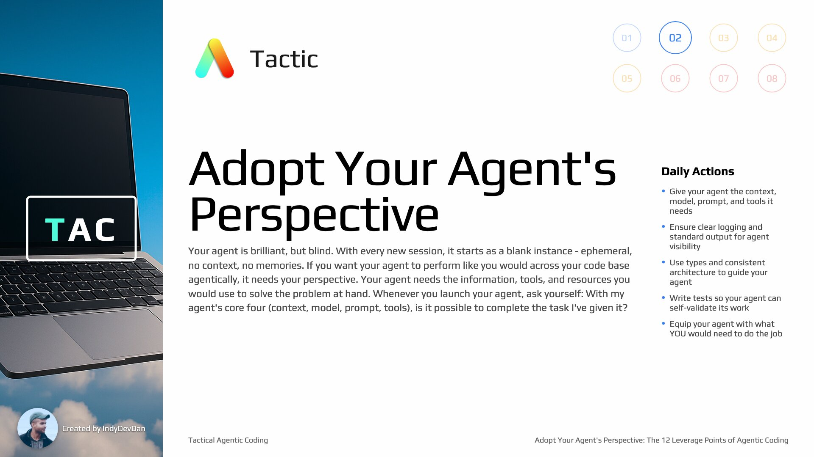

## Overview

Step inside your agent's context window and see your codebase through its eyes. Master the Core Four and eight additional leverage points to maximize not what you can do, but what your agents can do for you.

## Key Concepts

### Phase 2 Software Development Lifecycle

Plan, Code, Test, Review, Document - The compressed, focused version of the software development lifecycle built for phase two of the generative AI age.

### The 12 Leverage Points of Agentic Coding

There are 12 leverage points of agentic coding you can use to multiply your agent's ability to execute on your behalf. These leverage points are the key to becoming an irreplaceable engineer.

## Tactic #2: Adopt Your Agent's Perspective

Your agent is brilliant, but blind. With every new session, it starts as a blank instance - ephemeral, no context, no memories. If you want your agent to perform like you would across your code base agentically, it needs your perspective. Your agent needs the information, tools, and resources you would use to solve the problem at hand.

### Always Think from Agent's Perspective

Consistently adopting your agent's perspective closes the gap between what you can do and what your agent can do. This is the core philosophy of high-leverage agentic coding.

### Two Types of Leverage Points

In-Agent leverage points are internal to the agent (Context, Model, Prompt, Tools). Through-Agent leverage points are external things your agent can interact with to increase leverage.

## The Core Four: In-Agent Leverage Points

Context, Model, Prompt, and Tools - these are the four in-agent leverage points that are always with your agent. These are the foundational leverage points for agentic coding success.

### 1. Context: What Can Your Agent See?

Context is everything your agent can see in its context window. The question is: can our agent see everything it needs to complete the task successfully? Always think from your agent's perspective about context.

### 2. Model: The Engine of Your Agent

The model powering your agent determines its reasoning capabilities and performance.

### 3. Prompt: Your Instructions to the Agent

The prompt directs what the agent should do and how it should approach problems.

### 4. Tools: Capabilities for Action

Tools enable your agent to interact with external systems, run commands, and perform actions.

## Through-Agent Leverage Points

### Documentation: Agent-Specific Context

Documentation written for agents is different from documentation written for humans. Agent-specific documentation focuses on what the agent needs to know to complete tasks successfully.

### Types: Structured Information for Agents

Types are a fantastic way to communicate structured information to your agent. They provide clear contracts and expectations that help agents understand exactly what they're working with.

### Architecture: Code-Based Navigation

Architecture that agents can follow is a massive leverage point. Make it easy for your agent to understand and navigate your codebase structure.

### Tests: Validation and Self-Correction

Tests are one of the highest leverage points of agentic coding. If your agent can run tests, it can validate its own work and self-correct. This is critical for autonomous agent success.

### Planning: Meta-Work for Agents

High-leverage agentic coding includes planning meta-work. Let your agent plan its approach before execution - this dramatically improves success rates.

### AI Developer Workflows (ADWs)

ADWs combine one or more agentic prompts with deterministic code to create reusable workflows. They represent a major leverage point in agentic coding.

## Measuring Success

### Agentic Coding KPIs

Key performance indicators for agentic coding help you measure improvement. Focus on longer agent runs, reduced iteration cycles, and increased autonomous success rates.

### One-Shot Agentic Coding Success

The goal is one-shot agentic coding success - getting results right the first time without iteration. This requires mastering all leverage points.

## Summary

### Mastering All 12 Leverage Points

Stack up all 12 leverage points to maximize agentic coding success. Focus on the Core Four first, then add through-agent leverage points for massive capability multiplication.

### Transition from AI Coding to Agentic Coding

We're not AI coders anymore. We're adopting our agent's perspective and giving our agents the leverage points they need to succeed autonomously.
