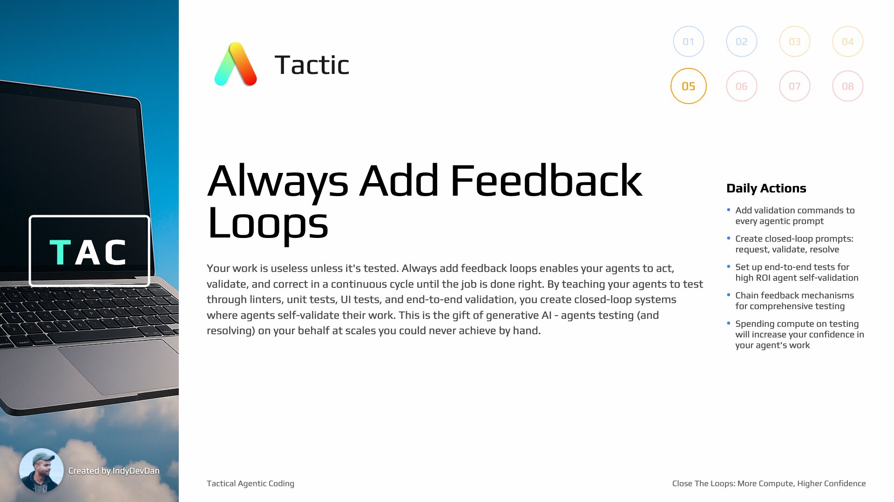

## Overview

Close the loop(s) and let the code write itself. Transform brittle agent workflows into self-correcting systems with strategic feedback loops. Build 'Closed Loop Prompts' that ensure your agents correct their own work so you don't have to.

## Tactic #5: Always Add Feedback Loops

Your work is useless unless it's tested. Always add feedback loops enables your agents to act, validate, and correct in a continuous cycle until the job is done right. By teaching your agents to test through linters, unit tests, UI tests, and end-to-end validation, you create closed-loop systems where agents self-validate their work.

## Key Concepts

### Your Most Valuable Contribution

Our most valuable contribution is the experience we create for our users. Making sure all engineering stuff does what it's meant to do is one of the most valuable things we can do.

### The Gift of Generative AI

Agentic coding presents us with a massive opportunity to have your agents test on your behalf like you never could at scales you never will achieve. This is the gift of generative AI and the agent architecture.

### The Core Validation Question

Given a unit of valuable work that's production ready, how would you, the engineer, test and validate this work? If you can answer this for every class of work and encode it into commands or tool calls, you will fly while other engineers run.

### Architecture Leverage

Codebase architecture comes into play as a massive critical leverage point. Net new code bases have a massive advantage here when it comes to validation and testing.

### Common Validation Steps

Examples of validation: run your linter, execute unit tests, run UI tests, CI/CD integration tests, build/compile your application, check Datadog logs, monitor Sentry for errors, run custom evaluations, or LLM as judge workflows.

### Manual Testing is a Waste of Time

Opening the browser and clicking through your new feature is a waste of time. These are all feedback loops you can now hand off to your agents - work you don't have to do anymore.

### Your Work is Useless Unless Tested

Your work, my work, any engineer's work is useless unless it's tested. The ultimate test will always be your users. The next best test used to be you. Now, the next best test is an army of agents validating your entire codebase.

### Army of Agents Validation

An army of agents validating your entire code base with regression tests and most importantly with end-to-end tests. Start handing off this responsibility and teaching your agents to test.

### Closed Loop Feedback Systems

When you do this, you create closed loop feedback systems where your agent can execute, validate, and reflect on the work done in a loop until the job is done right.

### Building the System That Builds the System

This is us building the system that builds the system. Keep this idea in mind because this is the differentiating factor between agentic engineers and engineers of the past.

## Terminology

### In-Loop vs Out-Loop

- **In-loop agent coding**: You sitting here, prompting back and forth with your agent
- **Out-loop**: A high level prompt running through the PITER system that fires off on your isolated device
- **Closing the loop**: Letting your agent operate on work, get feedback, and continue until feedback is positive

### Let the Code Write Itself

When you close the loop, you let the code write itself. You let the agent operate with the right information so well that it closes the loop and continues building until the feedback is positive.

## Testing Philosophy

### Engineers That Test With Agents Win

Now engineers that test with their agents win. Full stop, zero exceptions. This is because the value of tests are multiplied by the number of agent executions that occur in your code base.

### Confidence Through Testing

If your auth tests are passing, you can be more confident your authentication system is working. With every passing set of tests, you free your context window and you stop second guessing so you can focus on what's next for your users.

### Test, Let Your Agents Scale Your Success

Test, let your success scale. As you're testing every net new feature with your agents, you can scale with confidence. With agentic coding, test, let your agents scale your success.

## Agentic Coding KPIs

Great Agentic Coding KPIs:

- **Attempts**: We want attempts DOWN
- **Size**: We want size UP
- **Streak**: We want streak UP
- **Presence**: We want our presence DOWN

How do we accomplish this? With upfront investment into the new agentic layer of our code base.

### End-to-End Agents, Not In-Loop

Remember, we want end-to-end agents, not in-loop agents. We don't want to be babysitting our agents. We want work done agentically.

## Integration Tips

### Everything is One Tool Call Away

Remember everything is one tool call away. Tools are just functions and functions can do anything. We'll work through these capabilities using in-loop agentic coding for presentational purposes, but you want to be doing less and less of this.

### Stay Out The Loop

As you progress, you wanna be doing less and less in-loop prompting. You wanna stay out the loop, kicking off workflows that run in an agent environment.

### Outloop AFK Agent Using PITER Framework

Spin up a new Outloop AFK agent using the PITER framework we discussed in the previous video. This is the system that lets us stay out of the loop while agents handle the work.

### GitHub Issue as Trigger

GitHub issues serve as triggers for our AFK agents. Creating a new issue kicks off the workflow through webhooks, demonstrating the 'T' in PITER (Trigger).
