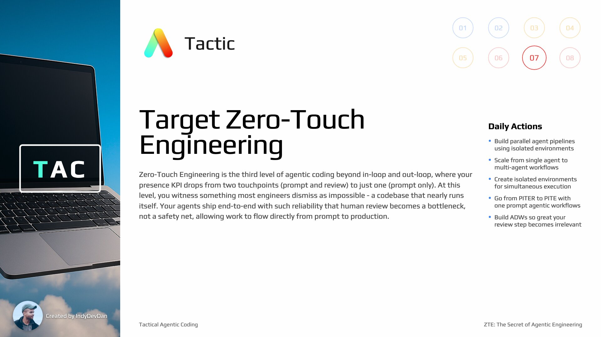

## Overview

Understand the North Star of Agentic Coding where your codebase ships itself. Progress from in loop, to out loop, to ZTE.

## Tactic #7: Target Zero-Touch Engineering

Zero-Touch Engineering is the third level of agentic coding where your presence KPI drops from two touchpoints (prompt and review) to just one (prompt only). Build systems so reliable that human review becomes a bottleneck, not a safety net.

## Key Concepts

### Witness the Impossible: A Codebase That Runs Itself

You'll witness something most engineers dismiss as impossible: a codebase that nearly runs itself. This is the edge of agentic coding where you ship end-to-end with out-loop systems.

### Invest in Your Agentic Layer

See what it looks like to fully invest in your agentic layer. The more you invest in the agentic layer, the more your agents can solve problem classes autonomously.

### Git Work Trees for Agent Parallelization

Use Git work trees to enable multiple agent pipelines to execute simultaneously in isolated environments on a single device. This parallelizes your AI developer workflows.

### Containerization Alternatives for Agent Isolation

You can use Docker or agent-based containerization frameworks instead of Git work trees. The key is providing isolated environments for simultaneous agent execution.

### Scaling Beyond In-Loop Agentic Coding

Focus on the key idea of scaling beyond what in-loop agentic coding can offer. Move from interactive prompting to building autonomous systems that ship end-to-end.

### Integrate Your Engineering Practices

Out-loop systems outperform out-of-the-box agentic coding tools because they contain your engineering practices and domain knowledge. Embed your best practices into the agentic layer.

### ADW Scripting Layer for Agent Pipelines

Use the ADW (Agentic Developer Workflow) scripting layer for constructing agent pipelines. This solves specific problem classes back-to-back with integrated development infrastructure.

### Gradual Transition to Out-Loop

The transition to out-loop isn't binary but gradual. Move toward operating out-of-the-loop more frequently. Workflows won't work perfectly end-to-end initially - that's acceptable.

### Dedicated Environments for Agent Safety

Agents need dedicated, isolated, safe environments for parallel operation. Use containerization or Git work trees to ensure multiple agents can work simultaneously without interference.

### Agent Multiplication Through Isolation

Multiply agents through parallel, isolated environments. Each agent needs dedicated, isolated, safe environments to operate simultaneously without interference.

### Build the System That Builds the System

Focus on meta-engineering: creating systems that generate other systems. Time spent building the agentic layer pays exponential dividends in engineering leverage.

### Review Is Especially Important

Review is especially important in agentic systems. Build both automated and human review processes to ensure agent-generated code meets quality standards before deployment.

### The ZTE Workflow: Plan -> Build -> Test -> Review -> Generate -> Ship

Zero-Touch Engineering workflow:

1. **Plan** the feature
2. **Build** the implementation
3. **Test** functionality
4. **Review** quality
5. **Generate** documentation
6. **Ship** to production

This enables agents to ship end-to-end without human intervention.

### The Secret: Composable Agentic Primitives

The secret of tactical agentic coding: it's not about the software developer lifecycle at all. It's about composable agentic primitives you can use to solve any engineering problem class.

### Composable Primitives Trump Traditional SDLC

Build arbitrary AI developer workflows using composable primitives that outperform traditional SDLC. Different compositions work for web apps, CLI tools, notebooks - flexibility trumps rigid lifecycle.

### Evolution Beyond SDLC

Each organization will have unique primitive compositions. AI workflows will outperform traditional approaches as we move away from rigid development lifecycles to flexible primitive composition.

### Achieve Zero-Touch Engineering

Zero-Touch Engineering is where your codebase literally ships itself. Progress from Out-Loop to Zero-Touch when confidence hits 90% and human review becomes a bottleneck rather than a safety net.

## Three Levels of Agentic Coding

| Level | Description | Presence KPI |
| ----- | ----------- | ------------ |
| **In-Loop** | Interactive prompting, back-and-forth with agent | High (constant) |
| **Out-Loop** | AFK agents, PITER framework, trigger-based | Medium (prompt + review) |
| **Zero-Touch** | Codebase ships itself, automated end-to-end | Low (prompt only) |
