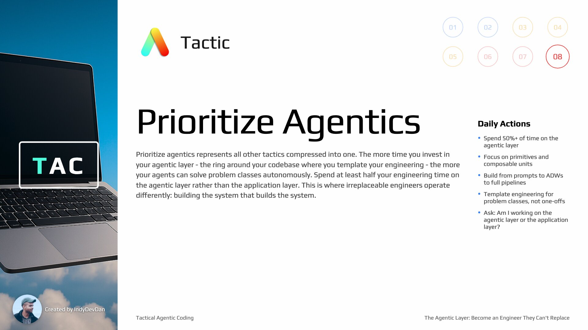

## Overview

Learn the one meta-tactic to rule them all. The single idea you need to become irreplaceable in phase 2 of the Generative AI age.

## Tactic #8: Prioritize Agentics

Prioritize your agentic layer. More than half of your engineering time should be spent on the agentic layer rather than the application layer. This tactic represents all others compressed into one.

## Key Concepts

### The Agentic Layer Ring

Imagine a ring around your codebase. At first it's thin, then it becomes thicker as you scale agentics into your codebase. Machines that operate with your judgment, shipping your way, getting work done autonomously in your product.

### The Single Guiding Question

At the end of this course, there'll be a single guiding question you can use to know whether you're moving in the right direction. This question represents the oil of this course - all the tactics compressed into one.

### 50%+ Time on Agentic Layer

As a starting point, at least half of your engineering time should be spent on the new agentic layer. The more time you invest into your agentic layer, the more it will be able to solve problem classes on your behalf.

### Agentic Layer vs Application Layer

There's the agentic layer, and then there's the application layer. Inside application layer: DevOps, infrastructure, database, and the actual raw application layer. The irreplaceable engineer operates on the agentic layer much more often.

### Focus on the Primitives

Focus on the pieces that make the whole, from the individual agentic prompts up to the composed multi-step AI developer workflows. This is what matters - the primitives, not the tool.

### Minimum Viable Agentic Layer

For your minimum viable agentic layer, you really only need these pieces:

- **AI developer workflow directory**
- **Prompts** (stored in .claude commands)
- **Plans**

This is the minimum set of information that you need.

### Problem Classes, Not One-Offs

Focus on problem classes, not one-off fixes. You want to solve the class of problems that you're approaching. You can do that by templating your engineering inside of powerful template meta prompts.

### The Gateway Script

This script is the gateway into agentic coding. It's the minimal version of what you need to get started. It's distinctly different from any other type of code - it's calling an agent.

### Moving Out of the Loop

By creating a script that can surround the application, that can surround any unit of code, we are slowly moving out the loop. You're not responding here, not having a conversation with the agent.

### Parabolic Value of Agentic Layer

Building an agentic layer is parabolic. Put 10 minutes in, get two hours of value out or more. It starts thin, not very useful at first, but as you keep adding new AI developer workflows, this layer becomes more and more valuable.

## The Two Layers

| Layer | Contents | Time Investment |
| ----- | -------- | --------------- |
| **Agentic Layer** | AI workflows, prompts, plans, templates | 50%+ of your time |
| **Application Layer** | DevOps, infrastructure, database, application code | <50% of your time |

## Minimum Viable Agentic Layer Components

1. **AI Developer Workflow Directory**: Organized structure for your agentic pipelines
2. **Prompts**: Stored as .claude commands or similar
3. **Plans**: Templates for common problem classes

## The Guiding Question

> "Am I investing enough time in my agentic layer to solve problem classes autonomously?"

If the answer is no, prioritize agentics.
