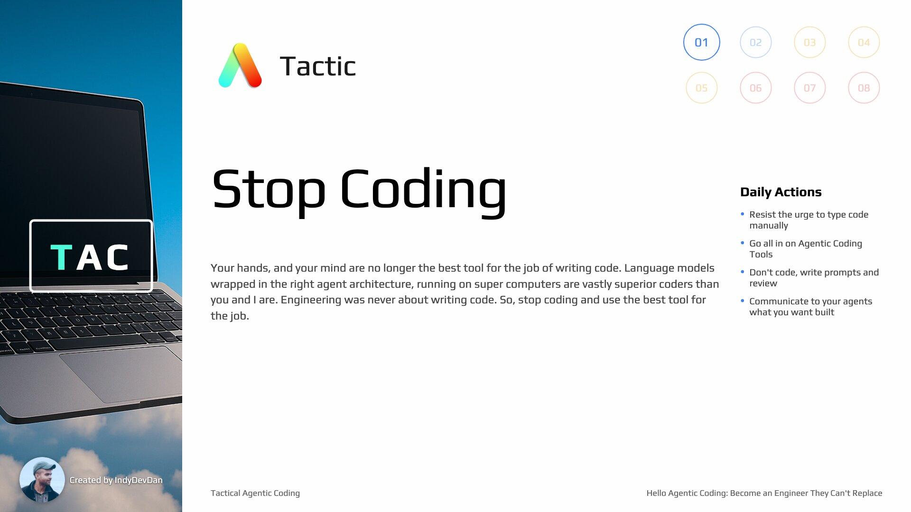

## Overview

Discover why your hands and mind are no longer the best tools for writing code. Make the hard, but important decision to let go of the old ways of engineering to adopt the new. Set the stage for learning the new way to engineering with agents and the core four.

## Key Concepts

### AI Coding is NOT enough

AI coding is NOT enough. Engineering is about much more than just writing code. AI coding was just phase one. Agentic coding marks phase two - this is where real engineers strike back.

### TAC Mission: Become Irreplaceable

We have one mission in tactical agentic coding: transform you into an engineer they can't replace. You know who they are. It's your boss. It's the company. It's the industry. It's AI.

### Commander of Compute

How do we become irreplaceable? We move up the stack once again. We become a commander of compute. You don't just prompt to generate code. That's phase one engineering. You take this compute and use it to build systems that build systems.

### Engineering Was Never About Writing Code

Engineering was never about writing code. It's about building systems of leverage that produce valuable outcomes for your users and customers. Remember, you're an engineer, not a coder. The difference is massive.

### The 10X Engineer Opportunity

In every software revolution, there's an opportunity for you to become the fabled 10X engineer, not by spending 10X the time or effort, but by achieving 10X leverage. The number is arbitrary - it's 2X, 10X, 100X. It all depends on the leverage points you can find.

### Transform Code Into Self-Operating Machines

The irreplaceable engineer in phase two that we're aiming to become is the engineer that transforms their code bases into self-operating machines. You'll learn how to maximize your leverage so much so that your code base literally runs itself.

## Tactic #1: Stop Coding

Your hands and mind are no longer the best tool for the job of writing code. Language models wrapped in the right agent architecture, running on supercomputers are vastly superior coders than you and I are. Stop coding and use the best tool for the job.

### Throughout TAC: No Typing Code

Throughout TAC, Tactical Agentic Coding, we're not going to type a single line of code. This is the first and most foundational tactic. If you're still typing code, you have no chance of keeping up.

### Phase Two Role: Planning & Reviewing

To scale into this new phase two role, we need to allocate our engineering cycles to planning, reviewing, and creating closed loop structures. Code understanding is still critically important, but we're not coding anymore.

## The Core Four

### Claude Code: Primary Agentic Tool

Throughout tactical agentic coding, Claude Code will be our primary agentic coding tool. We're going to be using millions and millions of tokens. Just as Aider was for the AI coding phase one era, Claude Code represents the best phase two agentic coding tool.

### The Core Four: Context, Model, Prompt, Tools

Agentic coding expands the big three (context, model, prompt) by adding tools. When you add reliable tool execution, we upgrade the big three to the core four: context, model, prompt, and tools.

### Long-Running AI Developer Workflows

When you take the core four and wrap it in an agentic coding tool like Claude Code, you can create long running end-to-end AI developer workflows that run for minutes to hours with and without your oversight.

### Programmable Agentic Coding

Claude Code is programmable - you can run it from any programming language that has terminal access. We can embed our own agents, workflows, and agentic prompts across the software development lifecycle.

### Building Systems That Build Systems

We need this capability of having a programmable agentic coding tool because we want to be building systems that build systems for us. We can embed our tooling across developer environments to drive real engineering outcomes.

## Summary

### Lesson 1 Foundation Complete

This essential tactic, stop coding, and the key difference between AI coding and agentic coding will ripple throughout every lesson moving forward. Agentic coding is about building systems that build systems on our behalf.

### To Become Irreplaceable, Replace Yourself

The contradicting truth about what you'll learn in tactical agentic coding: To become an irreplaceable engineer, you will replace yourself. You won't see any vibe coders replicating what you'll be able to do.
