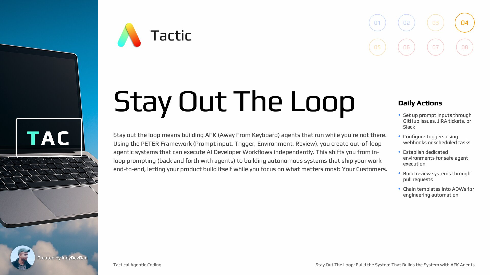

## Overview

Move beyond 'in the loop' agentic coding with a single agent with the PITER framework. Transform problems into solutions with a single prompt. Replace generic, 'built for everyone' expensive cloud tools with your own superior pipeline of agents that knows YOUR codebase and YOUR domain specific problems.

## Loot Box Content

Useful links, documentation, and tips for your AI coding experience. Resources unlocked as you progress through the lesson.

## Key Concepts

### Four Elements of AFK Agents

There are four elements you need to add to enable AFK agents in your development workflow. These elements work together to create autonomous systems that can ship features without your direct involvement.

### Replace Cloud-Based Agentic Tools

By the end of this lesson, you'll know exactly how to replace and outperform modern cloud-based agentic coding tools like Copilot, Devon, Jules, Codex, and other in-the-cloud coding agents with your own superior agentic layer.

### AFK Agents: Away From Keyboard

AFK agents enable you to step out of the loop and let your product build itself. These agents run in their own environment, triggered automatically, executing your workflows without your direct oversight.

## Tactic #4: Stay Out The Loop

Stay out the loop means building AFK (Away From Keyboard) agents that run while you're not there. Using the PITER Framework, you create out-of-loop agentic systems that execute AI Developer Workflows independently, letting your product build itself while you focus on what matters most.

### From Prompt to PR Automatically

With AFK agents, you go from prompt input to merged PR automatically. The agent executes the entire workflow - classification, planning, implementation, and review - without your direct intervention.

### AI Developer Workflows (ADWs)

An ADW is the synthesis of previous tactics - combining templates, prompts, and agents. ADWs are reusable agentic workflows that combine deterministic code with non-deterministic agents to solve problem classes.

### Build the System That Builds the System

Stay out the loop and let your product build itself. This is about building systems that operate autonomously, creating value while you focus on higher-level strategic work.

## The PITER Framework

The four elements of AFK agents can be remembered with PITER: Prompt input, Trigger, Environment, Review. These elements work together to create autonomous agentic systems that run while you stay out of the loop.

### P - Prompt Input via GitHub Issues

For prompt input, use GitHub issues. Create new issues that serve as the input for your AFK agents. This allows you to trigger workflows from your phone, Slack, or anywhere you can create issues.

### T - Trigger via GitHub Webhooks

For the trigger, use GitHub webhooks. When a new issue is created, the webhook automatically kicks off your AFK agent workflow, eliminating the need for manual intervention.

### E - Dedicated Environment

Your AFK agents need their own dedicated environment to run in. This isolated environment ensures safe execution and allows agents to work autonomously without interfering with your main development setup.

### R - Review via Pull Requests

The review system uses GitHub pull requests. After your AFK agent completes its work, it creates a PR for review. This gives you visibility and control over what gets merged while maintaining the autonomous workflow.

## Additional Resources

### Environment Variables and Prerequisites

Proper environment variable setup is crucial for AFK agents. Configure your environment variables, prerequisites, and access tokens to enable seamless autonomous operation.

### External Tools for AFK Agents

- **[ngrok - Getting Started](https://ngrok.com/docs/getting-started)**: Set up secure tunnels to localhost for webhook development. ngrok enables you to expose your local development environment to the internet, essential for testing webhooks and triggers.

- **[GitHub - Creating Webhooks](https://docs.github.com/en/webhooks/using-webhooks/creating-webhooks)**: Official GitHub documentation for creating webhooks. Learn how to configure webhooks to trigger your AFK agents when issues are created, PRs are opened, or other events occur.

- **[Cloudflare Tunnel - Get Started](https://developers.cloudflare.com/cloudflare-one/connections/connect-networks/get-started/)**: Alternative to ngrok - create secure tunnels to your local environment using Cloudflare. Provides a production-grade solution for exposing webhooks and services without opening ports.

## Building ADWs

### Chain Templates into ADWs

Your template meta-prompts from lesson 3 become the building blocks for ADWs. Chain templates together to create comprehensive workflows that solve entire problem classes autonomously.

### No Ad Hoc Prompts - Build Reusable Systems

Avoid ad hoc prompts that can't be improved. Build reusable, version-controlled prompts and templates that get better with each execution. Store your prompts in your codebase for continuous improvement.

### Programmable Agentic Coding Mode

Run Claude Code in programmable mode to build, log, and execute prompts systematically. This creates reproducible, improvable agentic workflows that can be version controlled and scaled.

### Integrate AFK Agents Into Your Workflow

The goal isn't to replace your entire development process overnight. Start by identifying repetitive tasks and problem classes, then build AFK agents to handle those specific workflows while you focus on higher-value work.

### Solve Problem Classes, Not Individual Problems

Focus on building ADWs that solve classes of problems rather than individual issues. This approach scales your engineering efforts and creates reusable autonomous workflows.

## Progress Milestone

You are now halfway through Tactical Agentic Coding! You've learned to stop coding, adopt your agent's perspective, template your engineering, and now stay out of the loop with AFK agents. The foundation is set for advanced techniques.
