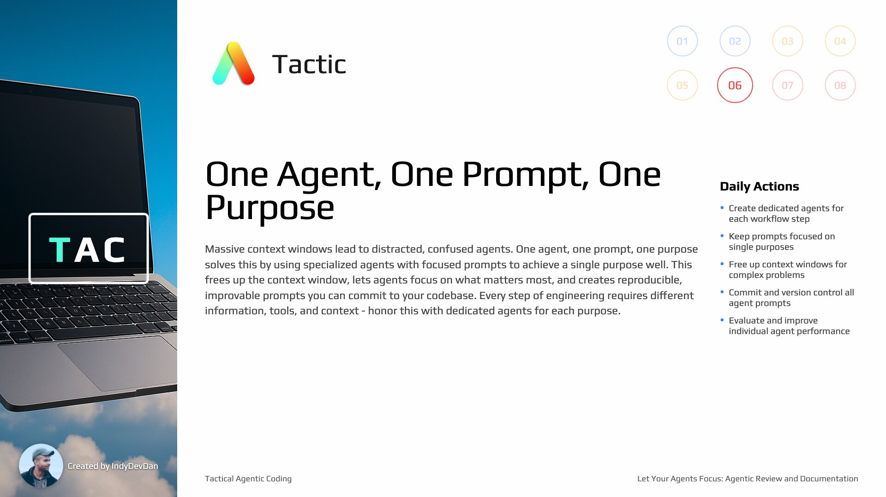

## Overview

Reach a critical milestone in your agentic coding journey with specialized Review and Documentation agents. Learn the crucial difference between testing and reviewing your agent's work.

## Tactic #6: One Agent, One Prompt, One Purpose

Specialized agents with focused prompts to achieve a single purpose well. This frees up the context window, lets agents focus on what matters most, and creates reproducible, improvable prompts you can commit to your codebase. Every step of engineering requires different information, tools, and context - honor this with dedicated agents for each purpose.

## Key Concepts

### Review vs Testing: Different Questions

Testing asks "does it work?" but Review asks "is what we built what we asked for?" These are fundamentally different questions that require different approaches. Review validates against the original plan, not just functionality.

### SDLC as Questions and Answers

Every step of the software developer lifecycle can be represented as a question:

- **Plan** asks "what are we building?"
- **Build** asks "did we make it real?"
- **Testing** asks "does it work?"
- **Review** asks "is what we built what we planned?"
- **Document** asks "how does it work?"

### Optimize for Agentic KPIs

We want attempts down, streak up, size up, presence down. These specialized agents can drastically increase your agentic coding KPIs and help you achieve higher success rates with lower human intervention.

### Documentation Creates Feedback Loops

Documentation provides feedback on work done for future agents to reference in their work. They can operate and then update the documentation when the time is right. This creates a complete software developer lifecycle feedback loop.

### Avoid Context Pollution

Massive context windows often lead to distracted, confused agents. Context pollution, context overloading, toxic context - whatever you call it, when you overload the context window, your agent has a harder time focusing on what matters most: the original task you asked it to complete.

### Engineering Steps Require Different Context

Every step of engineering requires a different set of information, a different approach, a different perspective. It requires a different set of tools and context. We operate one step at a time, and every step has unique requirements.

### Real Engineering Requires Real Developer Workflows

Real engineering requires real developer workflows, not some pie in the sky God model that claims to do it all. You can teach your agents how to operate your codebase to solve your problems through AI Developer Workflows.

### Use Specialized Agents with Focused Prompts

You want to use specialized agents with focused prompts to achieve a single purpose well. No agent runs more than a single prompt. This doesn't mean the prompt isn't large or doesn't do a lot of work - it means focused execution.

### Free Up the Context Window

You give your agent the full 200K, 500K, 1 million tokens - whatever you're working with - and give your agent all of the space and opportunity to solve the one problem well. This is important as your codebase grows.

### Three Constraints of Agentic Engineers

As agentic engineers, we have three constraints:

1. The context window
2. The complexity of our codebase and the problem we're solving
3. Our abilities

Specialized agents bypass two out of three of these constraints.

### Let Your Agents Focus

A focused engineer working on a single task is a productive engineer. Agents are the same. Big context windows cause context confusion, which drops your agent's performance. When your agent's performance drops, your performance drops.

### Minimum Context Principle

You want to context engineer as little as possible. You want the minimum context in your prompt required to solve the problem. Every piece of context you add increases the number of variables your agent has to reason about.

### Commit and Improve Your Prompts

We get to commit every one of our prompts and all of our workflows, which means we can easily improve them. Since you're not stacking up many prompt calls from who knows where, we can easily reproduce and more importantly, improve every single step down to the prompt level.

### Create Evals for Your Agentic Layer

By using individualized agents with specific prompts for one purpose, you effectively create evals for the agentic layer of your codebase. You can change the model, add thinking mode, change your agentic coding tool, and rerun these over and over to literally create evals for your codebase.
