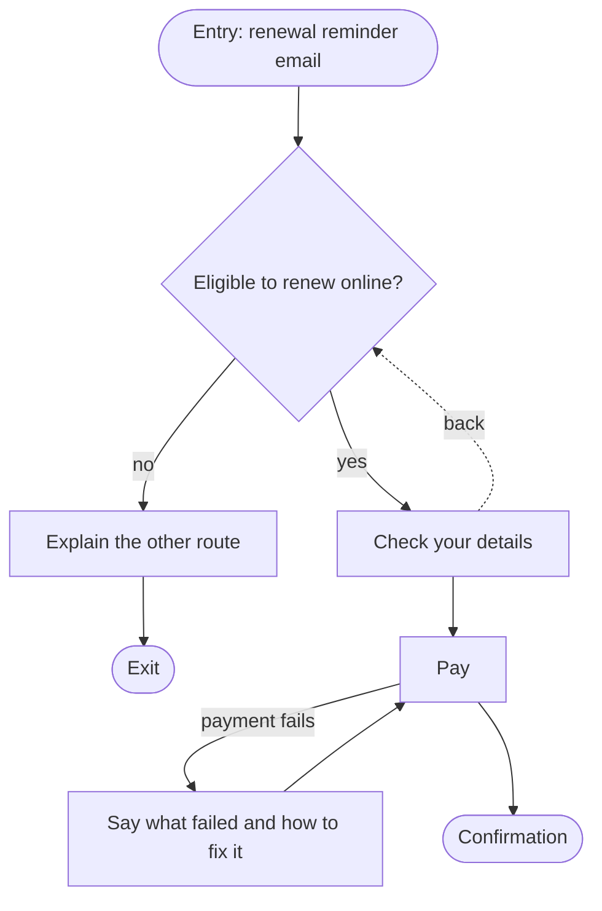
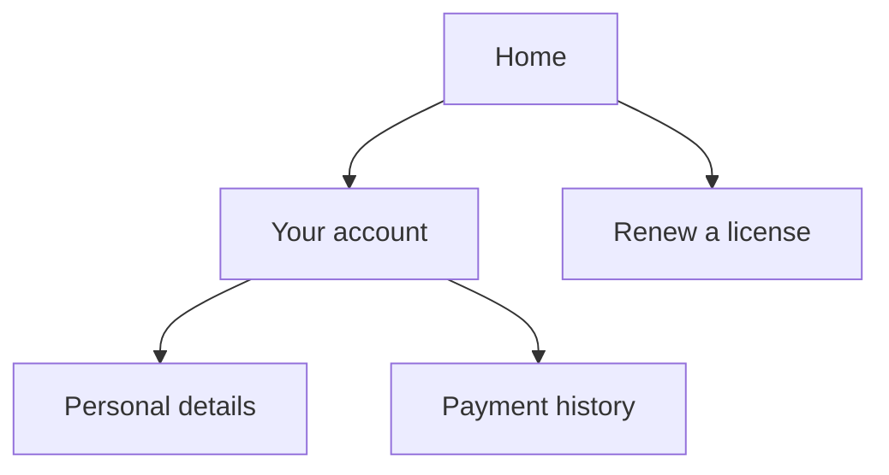

# User flows and information architecture

Load when: designing or reviewing a user flow (the steps, branches and exits of one task), the
information architecture (structure, groups, labels, navigation structure), or what each step must
tell or ask.

Confidence labels on each `Basis:` follow the plugin's research: HIGH means three or more
independent authoritative sources agree; HIGH (single source) is what one publisher states about its
own guidance; MEDIUM is one or two sources, used only as labeled judgment.

## Where flow ends and interface begins

Garrett's planes draw the line. Interaction design sits on the structure plane: how people reach a
screen, where they can go next, and how errors are handled. The placement of elements on a screen
sits on the skeleton plane, and look and feel on the surface plane. Garrett warns the lines blur and
decisions ripple both ways. Basis: [garrett-elements], HIGH (single source) for what the book
says; practitioners dispute splitting the work this way.

So this plugin owns the order of steps, the branches, the exits and which states each step must
handle; `/user-interface:design` owns how each step looks and responds. The shared hand-off is a
wireflow: page-level layouts joined by a simplified flowchart, suited to apps with few core screens
whose content changes. Basis: [nng-wireflows], HIGH (single source); the ownership split is
judgment.

## User flows

NN/g defines a user flow as the typical or ideal set of steps to complete one task, with the
system's responses. Basis: [nng-journeys-flows], HIGH (single source). A flow specification names
(Basis: judgment):

| Part | What to write |
|---|---|
| Entry points | Every way a person arrives: a link, a notification, a deep link, a search result. |
| Steps | One per screen or turn, each with the one thing it asks or tells. |
| Decisions | Each branch and the condition that takes it. |
| Exits | Success, a deliberate cancel, and every dead end. |
| Error and recovery paths | What can go wrong at each step and how the person gets back on track. |
| States per step | Which states the step must handle: empty, loading, partial, error, success. Their look belongs to `/user-interface:design`. |
| Evidence | The source for each step: the code, the running app, research, or "assumption". |

To break a complex task down first, a hierarchical task analysis splits the goal into sub-goals,
with a plan at each level for their order and exit conditions. Basis: judgment over MEDIUM
evidence ([nng-task-analysis]).

## Flow rules to check

- **Start with one thing per page.** One question, decision or piece of information per step, and
  merge steps only when research shows a need. GOV.UK lists the benefits: people understand what is
  asked, can focus, find their way through unfamiliar processes, use small screens and recover from
  errors, and the service can save answers and branch. Basis: [gds-form-structure], HIGH (single
  source) for GOV.UK's guidance; judgment over MEDIUM evidence that it works better in general.
- **Eligibility first, then branch.** Ask the questions that rule people out before anything else,
  and branch so each person answers only what applies to them. Basis: [gds-form-structure], HIGH
  (single source).
- **Load per step over step count.** Weigh what a person must consider inside each step (fields,
  questions) above how many steps there are, and keep long flows under review. Baymard's checkout
  research finds the number of fields affects checkout usability more than the number of steps.
  Basis: [baymard-fields], HIGH (single source, e-commerce checkout); applying it beyond checkout is
  judgment.
  - **Pointer**: for Baymard's current checkout benchmark figures (average steps and fields, the
    field count most sites need, and the step count past which usability suffers), read
    <https://baymard.com/research-articles/checkout-flow-average-form-fields>.
  - **As of**: 2026-10-04
  - **Recheck trigger**: Baymard publishes a new checkout benchmark.
- **Errors at every step boundary.** Give a clearly marked way out of an unwanted action, prevent
  error-prone conditions or confirm before the person commits, and say what went wrong and how to
  fix it. These are Nielsen's heuristics 3, 5 and 9; the heuristic set itself belongs to
  `/user-interface:design` when installed. Basis: [nng-heuristics], HIGH (single source); treating
  them as flow-level checks is judgment over MEDIUM evidence.
  - **Pointer**: for the current wording of heuristics 3, 5 and 9, read Nielsen's "10 Usability
    Heuristics for User Interface Design" at
    <https://www.nngroup.com/articles/ten-usability-heuristics/>.
  - **As of**: 2026-10-04
  - **Recheck trigger**: NN/g revises the page or its review date moves.
- **Leaving is as easy as joining.** A cancel, unsubscribe or delete path takes no more steps than
  the sign-up did. Basis: judgment; `reference/evaluation.md` `## Fair-choice check` has the full
  check.
- **Measure effort as interaction cost.** The mental and physical effort to reach a goal: reading,
  scrolling, finding, understanding, clicking, typing, waiting, switching attention and
  remembering. Click count is not interaction cost. Basis: [nng-interaction-cost], HIGH (single
  source).

## Reading the flow an app already has

- **Possible flow, from code.** Read the route list for the set of screens, then read links,
  redirects, form actions and navigation calls for the transitions, since route files alone do not
  show them. Check the framework's own routing docs for routes that render a different screen at the
  same URL depending on how the person arrived. State machines, where the app has them, list their
  states and transitions directly. Basis: [nextjs-routing], HIGH (single source) that route files
  do not list transitions and that intercepting routes exist; judgment for the method.
  - **Pointer**: for which files create a public route and how intercepting routes behave in the
    Next.js App Router, read <https://nextjs.org/docs/app/getting-started/project-structure>; for
    another framework, read its own routing docs.
  - **As of**: 2026-10-04
  - **Recheck trigger**: a Next.js major release changes the App Router file conventions.
- **Observed flow, from the running app.** Drive the app with a browser tool when one is installed
  (the routes `detect.mjs` reports) and record the screens and transitions actually seen. Basis:
  judgment.
- Mark each step with where it came from. A step seen only in code is "possible", not "observed".
  Basis: judgment.

## Flow format

Flows and IA are mermaid `flowchart` diagrams, with the evidence in a table beside them (Basis:
judgment):

## Information architecture

- Rosenfeld, Morville and Arango name four core IA systems: organization, labeling, navigation and
  search, with metadata and
  controlled vocabularies underneath. Basis: [rosenfeld-ia], HIGH (single source).
- IA is the underlying structure; navigation menus are the interface that exposes it. This plugin
  owns the structure and the labels; `/user-interface:design` owns the rendered menus and
  components. Basis: judgment over MEDIUM evidence ([nng-ia-vs-nav]).
- USWDS lists card sorting among generative methods and tree testing among evaluative ones. Basis:
  [uswds-research], HIGH (single source; USWDS describes the research behind its own design
  system).
- A card sort shows how people group and name things; a tree test measures whether they can find
  things in a text-only hierarchy. Sort, then tree-test, then design the navigation interface; a
  tree test cannot judge visual navigation such as layout or mega menus. Basis: judgment over
  MEDIUM evidence ([nng-tree-testing], [measuringu-tree]).
- Sample sizes depend on the goal and apply per user group. Card sort guidance runs from about 7 to
  10 people for moderated individual sorts to 30 to 50 for unmoderated ones; quantitative tree tests
  need about 50 or more. Basis: judgment over MEDIUM evidence ([nng-card-sort-size],
  [optimal-sample], [measuringu-tree]).
- An LLM can draft a card-sort grouping close to people's dominant groupings, but it is a draft to
  test, not a substitute for participants; agreement drops as cards and labels get more complex.
  Basis: judgment over MEDIUM evidence ([measuringu-chatgpt-sort]).
- Site search logs (top queries, zero-result queries) are evidence an agent can read without
  recruiting, to suggest labels and gaps. Treat what they suggest as hypotheses to check with
  people. Basis: judgment over MEDIUM evidence ([rosenfeld-search-analytics], [nng-taxonomy]).

An IA tree uses the same `flowchart` form, one node per section with its label as people would say
it (Basis: judgment):

## Content structure

This plugin decides what each step must tell or ask and whose words it uses; the wording, voice and
tone of interface text belong to `/user-interface:design`. Basis: judgment.

- **Question protocol.** For every question, record why it is asked: that the service needs the
  information, what it will do with it, who must answer, how the answer is checked, and how it is
  kept and secured. Drop a question that has no answer to those. Basis: [gds-form-structure], HIGH
  (single source); that the method traces to Caroline Jarrett is judgment over MEDIUM evidence
  ([jarrett-protocol]).
- **Ask only what the step needs.** Remove questions the service does not need; consent means
  explicit agreement, not a failure to object; a person who refuses keeps access to what does not
  depend on it; the privacy notice is specific to the service. Basis: [gds-personal-info], HIGH
  (single source; written for UK government services). The legal basis for collecting data is a
  question for a data-protection expert, never for this plugin. Basis: judgment.
  - **Pointer**: for the form-structure and personal-information guidance this section builds on,
    read <https://www.gov.uk/service-manual/design/form-structure> and
    <https://www.gov.uk/service-manual/design/collecting-personal-information-from-users>. Written
    for UK government services; other organizations adopt them by analogy.
  - **As of**: 2026-10-04
  - **Recheck trigger**: GDS updates either page, or moves form guidance into the GOV.UK Design
    System.
- **The user's own words.** Take labels and terms from research (interview vocabulary, search
  queries, support tickets), and mark a term with no such source as an assumption. Basis:
  judgment.

A content structure is a table per flow (Basis: judgment):

| Step | Must tell | Must ask (and why, per the protocol) | Words people use | Evidence |
|---|---|---|---|---|

[garrett-elements]: https://ptgmedia.pearsoncmg.com/images/9780321683687/samplepages/0321683684.pdf
[nng-wireflows]: https://www.nngroup.com/articles/wireflows/
[nng-journeys-flows]: https://www.nngroup.com/articles/user-journeys-vs-user-flows/
[nng-task-analysis]: https://www.nngroup.com/articles/task-analysis/
[gds-form-structure]: https://www.gov.uk/service-manual/design/form-structure
[baymard-fields]: https://baymard.com/research-articles/checkout-flow-average-form-fields
[nng-heuristics]: https://www.nngroup.com/articles/ten-usability-heuristics/
[nng-interaction-cost]: https://www.nngroup.com/articles/interaction-cost-definition/
[nextjs-routing]: https://nextjs.org/docs/app/getting-started/project-structure
[rosenfeld-ia]: https://www.oreilly.com/content/the-anatomy-of-an-information-architecture/
[nng-ia-vs-nav]: https://www.nngroup.com/articles/ia-vs-navigation/
[uswds-research]: https://designsystem.digital.gov/about/research/
[nng-tree-testing]: https://www.nngroup.com/articles/tree-testing/
[measuringu-tree]: https://measuringu.com/tree-testing/
[nng-card-sort-size]: https://www.nngroup.com/articles/card-sorting-how-many-users-to-test/
[optimal-sample]: https://support.optimalworkshop.com/en/articles/9679633-how-many-participants-you-need-for-reliable-results
[measuringu-chatgpt-sort]: https://measuringu.com/comparing-chatgpt-to-card-sorting-results/
[rosenfeld-search-analytics]: https://rosenfeldmedia.com/books/search-analytics-for-your-site-frequently-asked-questions/
[nng-taxonomy]: https://www.nngroup.com/articles/taxonomy-101/
[jarrett-protocol]: https://www.uxmatters.com/mt/archives/2010/06/the-question-protocol-how-to-make-sure-every-form-field-is-necessary.php
[gds-personal-info]: https://www.gov.uk/service-manual/design/collecting-personal-information-from-users
