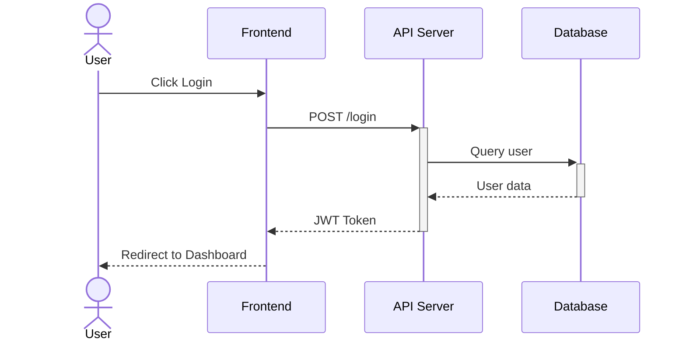
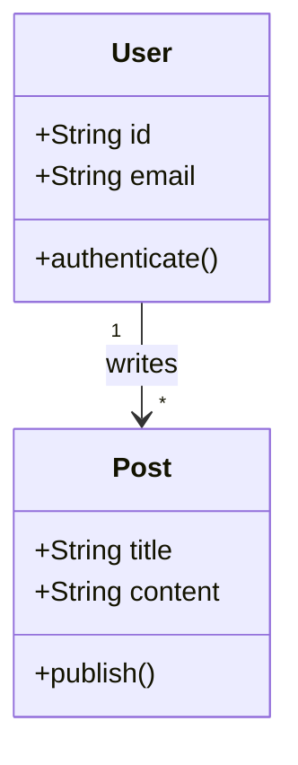
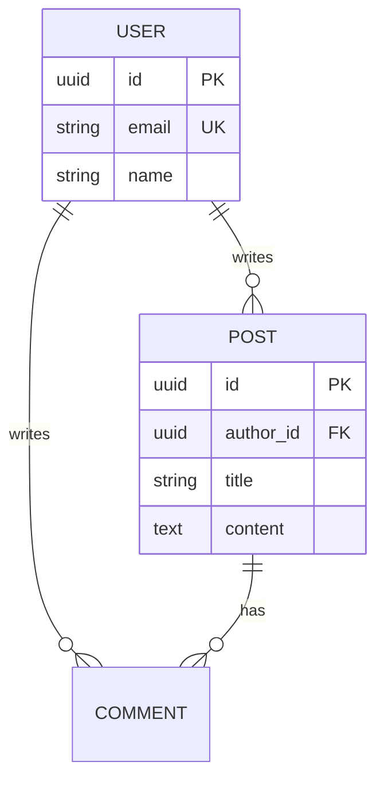

# Visualization Plugin

Diagrams-as-code tools for visualizing code, data, and systems using Mermaid and PlantUML.

## Overview

This plugin provides Claude Code with the ability to:

- **Generate diagrams from natural language** - Describe what you want, get diagram code
- **Visualize code structure** - Analyze source files and generate class/ER diagrams
- **Choose the right diagram type** - Decision guidance for diagram selection
- **Use correct syntax** - Authoritative Mermaid and PlantUML reference

## Installation

```bash
/plugin install visualization@claude-code-plugins
```

## Quick Start

### Generate from Description

```bash
# Sequence diagram
/visualization:visualize a sequence diagram showing user login authentication

# Class diagram
/visualization:visualize class diagram for a blog with users, posts, and comments

# ER diagram
/visualization:visualize ER diagram for an e-commerce database

# Flowchart
/visualization:visualize flowchart for order processing with validation and error handling

# C4 Architecture
/visualization:visualize C4 context diagram for a microservices e-commerce system
```

### Generate from Code

```bash
# Auto-detect diagram type
/visualization:visualize-code src/models

# Explicit class diagram
/visualization:visualize-code src/services class

# ER diagram from Prisma schema
/visualization:visualize-code prisma/schema.prisma er

# Sequence from API routes
/visualization:visualize-code src/routes sequence

# Dependency graph
/visualization:visualize-code src dependency
```

## Components

### Skills

| Skill | Purpose |
| --- | --- |
| `mermaid-syntax` | Comprehensive Mermaid syntax reference |
| `plantuml-syntax` | Comprehensive PlantUML syntax reference |
| `diagram-patterns` | Diagram type selection guidance and patterns |

### Agents

| Agent | Purpose |
| --- | --- |
| `diagram-generator` | Generate diagrams from natural language |
| `code-visualizer` | Analyze code and generate diagrams |

### Commands

| Command | Purpose |
| --- | --- |
| `/visualization:visualize` | Generate diagram from description |
| `/visualization:visualize-code` | Generate diagram from code analysis |

## Supported Diagram Types

### Mermaid (Default)

| Type | Best For |
| --- | --- |
| Flowchart | Process flows, decision trees |
| Sequence | API calls, interactions |
| Class | OOP structure |
| State | Simple state machines, lifecycle |
| ER | Database schemas |
| Gantt | Project timelines |
| Git Graph | Branching strategies |
| C4 | Architecture (experimental) |

### PlantUML

| Type | Best For |
| --- | --- |
| Sequence | Complex interactions |
| Class | Detailed OOP design |
| Activity | Workflows with swimlanes |
| Component | System structure |
| Deployment | Infrastructure |
| State | Complex/nested state machines |
| C4 | Architecture (mature support) |
| MindMap | Hierarchical ideas |
| JSON | Data structure visualization |

## When to Use Each Tool

### Choose Mermaid When

- Documentation lives in GitHub/GitLab (native rendering)
- Simple to moderate complexity
- Quick iteration needed
- Zero setup preferred
- ER or state diagrams (better default styling)

### Choose PlantUML When

- Complex C4 architecture diagrams
- Maximum customization needed
- MindMaps or JSON visualization
- Sprites/icons required
- Enterprise architecture modeling

## Examples

### Sequence Diagram (Mermaid)



### Class Diagram (Mermaid)



### ER Diagram (Mermaid)



### C4 Context (PlantUML)

```plantuml
@startuml
!include https://raw.githubusercontent.com/plantuml-stdlib/C4-PlantUML/master/C4_Context.puml

Person(user, "User", "End user")
System(app, "Application", "Main system")
System_Ext(email, "Email Service", "Sends notifications")

Rel(user, app, "Uses")
Rel(app, email, "Sends emails")
@enduml
```

## Invoking Skills Directly

For syntax reference without generating a diagram:

```bash
# Get Mermaid syntax help
> Invoke the visualization:mermaid-syntax skill

# Get PlantUML syntax help
> Invoke the visualization:plantuml-syntax skill

# Get diagram selection guidance
> Invoke the visualization:diagram-patterns skill
```

## Integration with Other Plugins

This plugin is designed as a foundation layer that can be used by other plugins:

- **Future `enterprise-architecture` plugin** - Will use visualization skills for TOGAF/Zachman diagram rendering
- **`code-quality` plugin** - Could use code-visualizer for architecture reviews

## Roadmap

- [ ] D2 diagram language support
- [ ] Graphviz/DOT support
- [ ] MCP integration for live rendering (mcp-mermaid)
- [ ] Syntax validation hooks
- [ ] Diagram export to PNG/SVG

## Contributing

Contributions welcome! Areas of interest:

- Additional diagram type patterns
- Language-specific code analysis improvements
- New diagram tool support
- Integration with rendering services

## License

MIT

## Related Resources

- [Mermaid Documentation](https://mermaid.js.org/)
- [PlantUML Documentation](https://plantuml.com/)
- [C4 Model](https://c4model.com/)
