# Diagram Selection & Patterns

## Overview

This skill helps you choose the right diagram type and tool for your visualization needs. Use this when you need to decide:

1. **Which diagram type** best represents your information
2. **Which tool** (Mermaid or PlantUML) to use
3. **How to structure** the diagram for clarity

---

## Diagram Type Decision Tree

### What are you trying to visualize?

```text
START
  |
  +-- Interactions over time? --> SEQUENCE DIAGRAM
  |
  +-- Object/class structure? --> CLASS DIAGRAM
  |
  +-- Database schema? --> ER DIAGRAM
  |
  +-- State transitions? --> STATE DIAGRAM
  |
  +-- Process/workflow? --> FLOWCHART or ACTIVITY DIAGRAM
  |
  +-- System architecture?
  |     |
  |     +-- High-level context? --> C4 CONTEXT
  |     +-- Containers/services? --> C4 CONTAINER or COMPONENT
  |     +-- Infrastructure? --> DEPLOYMENT DIAGRAM
  |
  +-- Project timeline? --> GANTT CHART
  |
  +-- Git branching? --> GIT GRAPH (Mermaid only)
  |
  +-- Hierarchical ideas? --> MINDMAP (PlantUML only)
  |
  +-- Data structure? --> JSON DIAGRAM (PlantUML only)
```

---

## Tool Selection Guide

### Quick Decision Matrix

| Need | Recommended Tool | Reason |
| --- | --- | --- |
| GitHub/GitLab rendering | **Mermaid** | Native support |
| Complex C4 models | **PlantUML** | Mature, better rendering |
| Simple sequence/class | **Mermaid** | Simpler syntax |
| MindMaps | **PlantUML** | Only option |
| JSON visualization | **PlantUML** | Only option |
| GitGraph | **Mermaid** | Only option |
| ER diagrams | **Mermaid** | Better default rendering |
| State diagrams | **Mermaid** | Cleaner output |
| Maximum customization | **PlantUML** | More styling options |
| Zero setup | **Mermaid** | Browser-based |
| Enterprise architecture | **PlantUML** | Better ArchiMate, C4 |

### Detailed Comparison

| Feature | Mermaid | PlantUML |
| --- | --- | --- |
| **Setup** | None (browser) | Java + GraphViz |
| **Markdown integration** | Native (GitHub, GitLab) | Requires image embedding |
| **Learning curve** | Gentle | Steeper |
| **Customization** | Limited | Extensive |
| **C4 support** | Experimental | Mature |
| **Diagram types** | ~10 | 15+ |
| **JSON/MindMap** | No | Yes |
| **GitGraph** | Yes | No |
| **Rendering quality** | Good | Good |
| **Version control** | Inline in Markdown | Separate .puml files |

### When to Choose Mermaid

- Documentation that lives in GitHub/GitLab repos
- Quick diagrams that need no setup
- Teams with mixed technical backgrounds
- Diagrams that need to stay in sync with docs
- Simple to moderately complex diagrams
- ER and state diagrams (better default styling)

### When to Choose PlantUML

- Complex enterprise architecture (C4, ArchiMate)
- Maximum control over appearance
- Specialized diagrams (MindMap, JSON, WBS)
- Established PlantUML workflow
- Need for sprites/icons
- Complex class diagrams with many relationships

---

## Pattern Library

### Sequence Diagram Patterns

#### API Request/Response

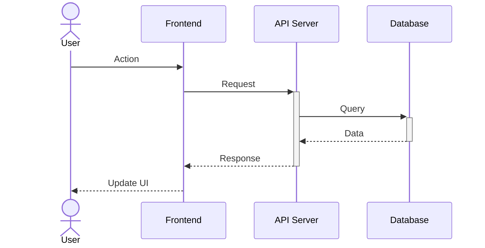

#### Authentication Flow

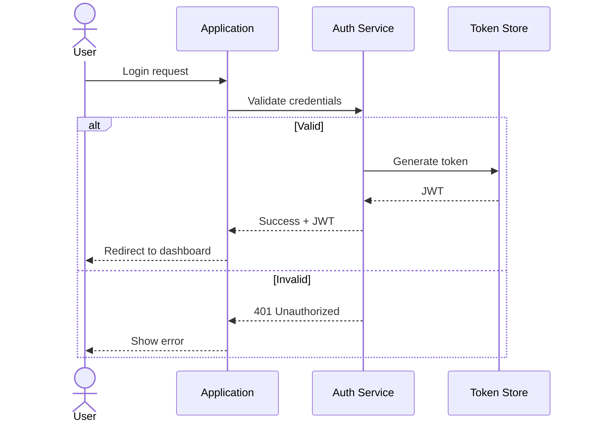

#### Async Processing

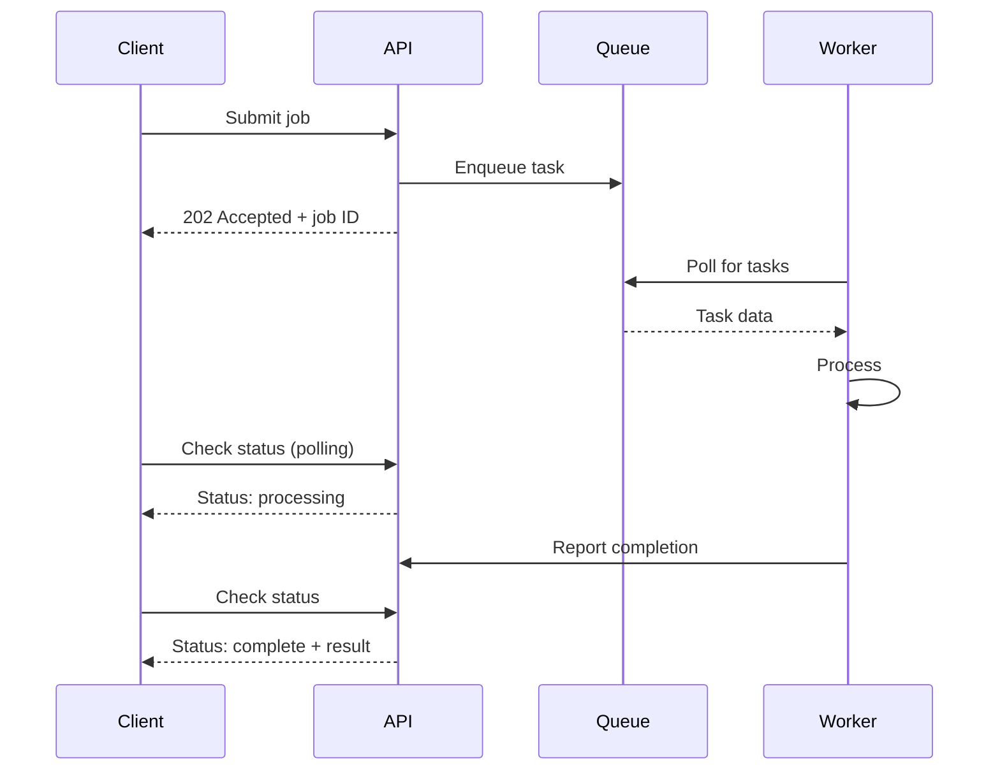

---

### Class Diagram Patterns

#### Domain Model

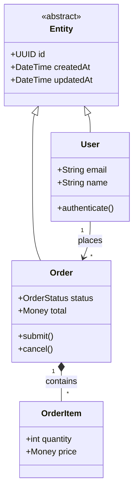

#### Repository Pattern

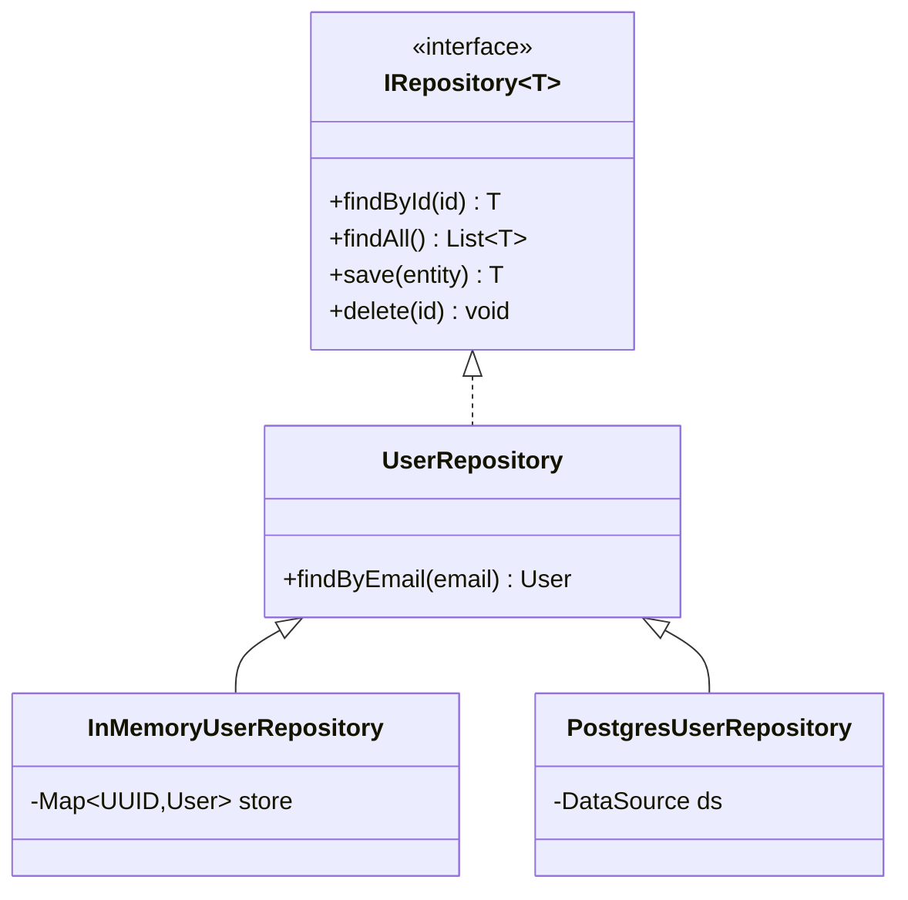

#### Service Layer

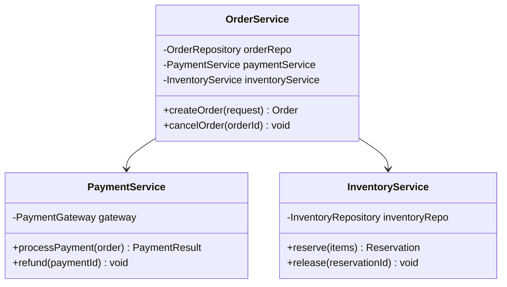

---

### ER Diagram Patterns

#### Blog Schema

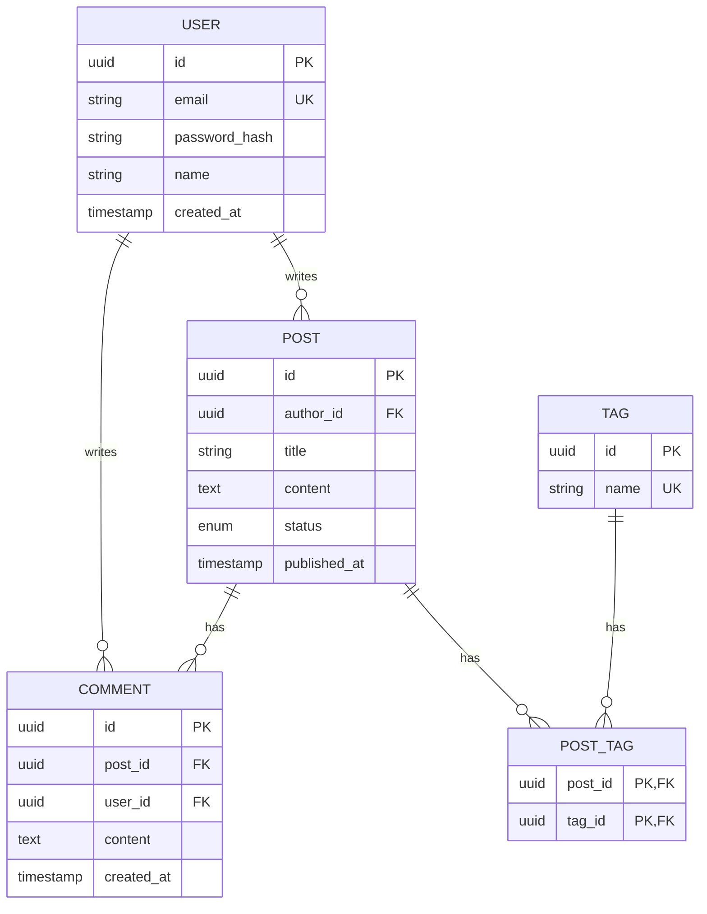

#### E-Commerce Schema

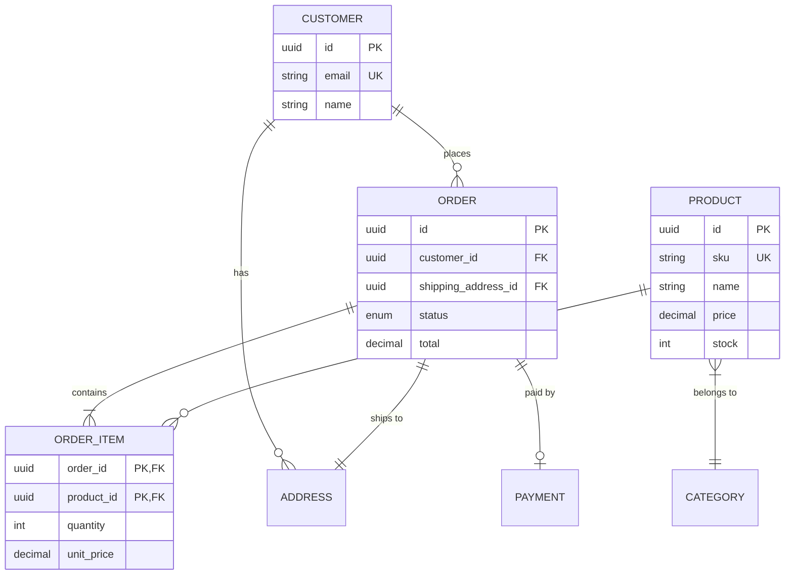

---

### State Diagram Patterns

#### Order Lifecycle

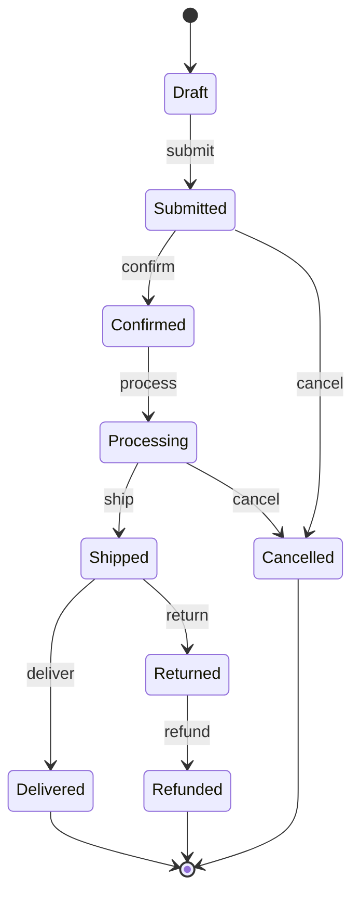

#### Authentication State

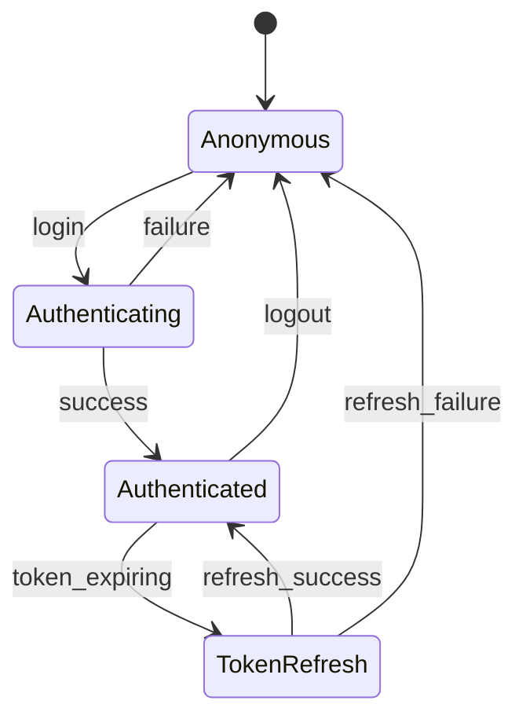

---

### Flowchart Patterns

#### Decision Tree

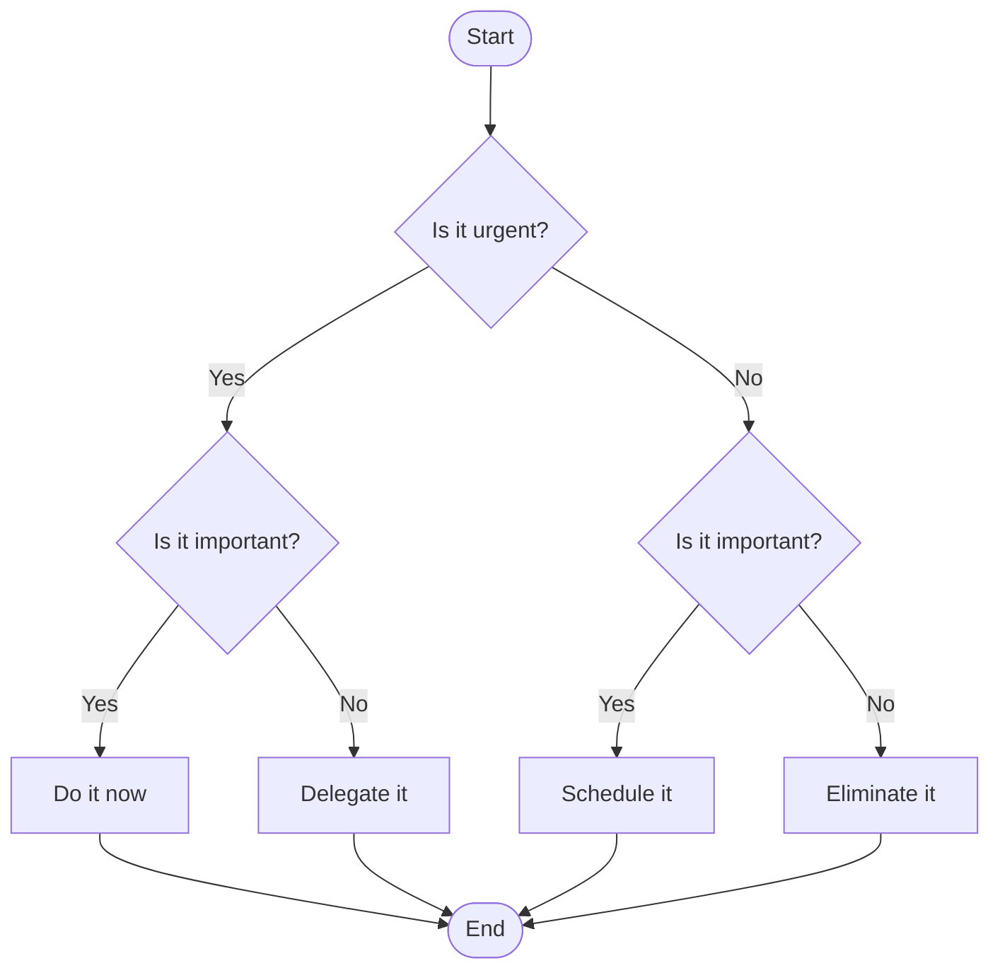

#### Error Handling Flow

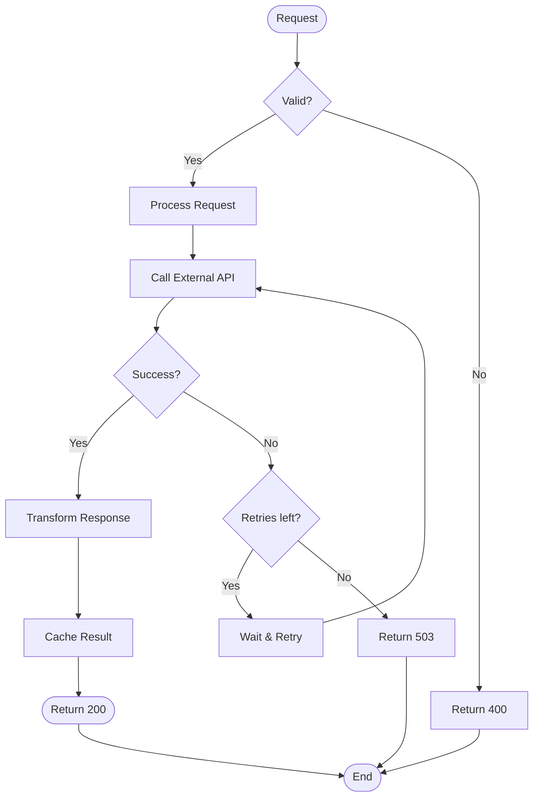

---

### C4 Patterns

#### System Context (Mermaid - Experimental)

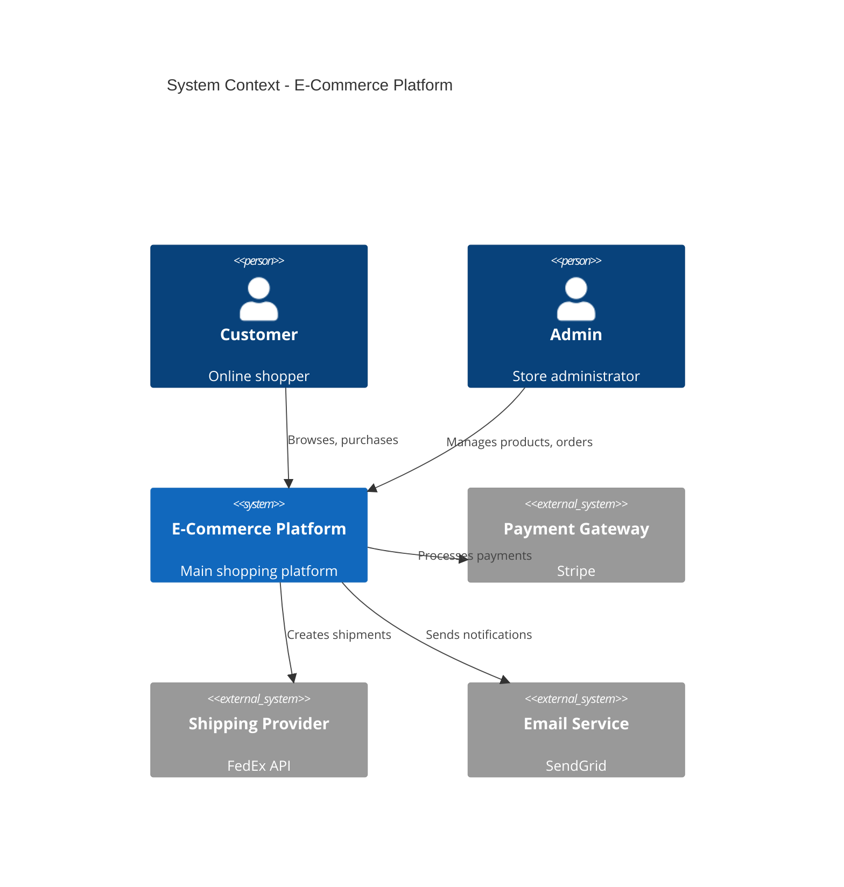

#### Container Diagram (PlantUML Recommended)

```text
@startuml
!include https://raw.githubusercontent.com/plantuml-stdlib/C4-PlantUML/master/C4_Container.puml

title Container Diagram - E-Commerce Platform

Person(customer, "Customer", "Online shopper")

System_Boundary(platform, "E-Commerce Platform") {
    Container(web, "Web Application", "React", "Customer-facing storefront")
    Container(admin, "Admin Panel", "React", "Back-office management")
    Container(api, "API Gateway", "Node.js", "API routing and auth")
    Container(catalog, "Catalog Service", "Go", "Product management")
    Container(orders, "Order Service", "Go", "Order processing")
    Container(cart, "Cart Service", "Go", "Shopping cart")
    ContainerDb(db, "Database", "PostgreSQL", "Persistent storage")
    Container(cache, "Cache", "Redis", "Session and product cache")
    Container(queue, "Message Queue", "RabbitMQ", "Async processing")
}

Rel(customer, web, "Uses", "HTTPS")
Rel(web, api, "API calls", "REST")
Rel(admin, api, "API calls", "REST")
Rel(api, catalog, "Routes to")
Rel(api, orders, "Routes to")
Rel(api, cart, "Routes to")
Rel(catalog, db, "Reads/Writes")
Rel(orders, db, "Reads/Writes")
Rel(cart, cache, "Reads/Writes")
Rel(orders, queue, "Publishes")
@enduml
```

---

## Best Practices

### General Guidelines

1. **Keep it simple**: Start with the minimum needed to convey the concept
2. **Use consistent naming**: Same entity = same name across diagrams
3. **Label relationships**: Arrows without labels are ambiguous
4. **Use direction thoughtfully**: TD for hierarchies, LR for flows
5. **Group related elements**: Use subgraphs/packages to organize
6. **Add legends**: For complex diagrams with many relationship types

### Diagram-Specific Tips

#### Sequence Diagrams

- Order participants left-to-right by typical flow
- Use activation bars to show processing time
- Group related interactions with boxes (alt, loop, opt)
- Add autonumber for complex sequences

#### Class Diagrams

- Show only relevant attributes/methods
- Use stereotypes to clarify roles (`<<Entity>>`, `<<Service>>`)
- Keep inheritance hierarchies shallow (2-3 levels)
- Position parent classes above children

#### ER Diagrams

- Always show primary keys (PK)
- Mark foreign keys (FK)
- Use relationship verbs ("places", "contains")
- Show cardinality on all relationships

#### State Diagrams

- Start from [*] initial state
- End at [*] terminal state
- Label all transitions with events
- Use composite states for complex machines

#### Flowcharts

- Use consistent shapes (rectangles for actions, diamonds for decisions)
- Flow generally top-to-bottom or left-to-right
- Avoid crossing lines when possible
- Label decision branches clearly (Yes/No, True/False)

---

## Anti-Patterns to Avoid

### Too Much Detail

- **Problem**: Diagram is cluttered and hard to read
- **Solution**: Create multiple focused diagrams at different abstraction levels

### Missing Context

- **Problem**: Diagram shows internal structure but not external interactions
- **Solution**: Start with context diagram, then zoom in

### Inconsistent Abstraction

- **Problem**: Mixing high-level and low-level concepts
- **Solution**: Keep consistent abstraction level per diagram

### Unlabeled Relationships

- **Problem**: Arrows connect things but meaning is unclear
- **Solution**: Always label with verb phrases (e.g., "uses", "contains", "sends")

### Missing Legend

- **Problem**: Custom shapes/colors without explanation
- **Solution**: Add legend for non-standard notation

---

## Quick Reference: Choosing Diagram Type

| Question | If Yes, Use |
| -------- | ----------- |
| Showing message flow between systems? | Sequence |
| Modeling OOP classes and relationships? | Class |
| Documenting database tables? | ER |
| Showing valid state transitions? | State |
| Depicting a process or algorithm? | Flowchart |
| High-level system overview? | C4 Context |
| Service/container architecture? | C4 Container |
| Timeline or schedule? | Gantt |
| Git branching strategy? | Git Graph |
| Brainstorming hierarchy? | MindMap |

---

## Delegation

For detailed syntax reference:

- **Mermaid syntax**: Invoke `visualization:mermaid-syntax` skill
- **PlantUML syntax**: Invoke `visualization:plantuml-syntax` skill

---

**Last Updated:** 2025-12-06
