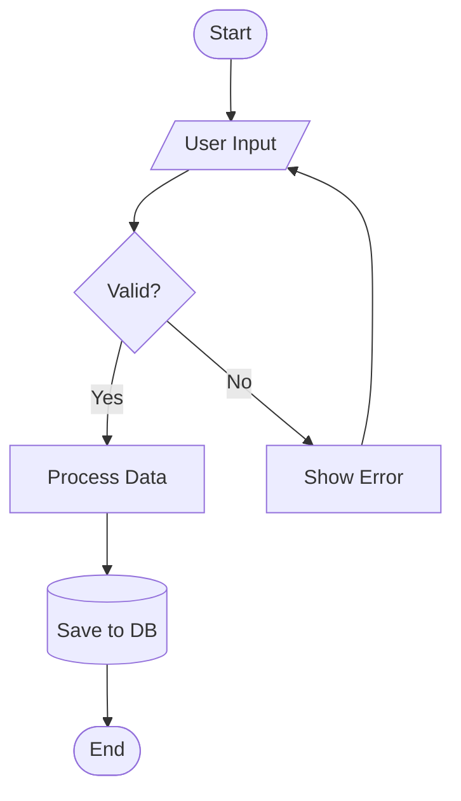

# Mermaid Syntax Reference

## Overview

Mermaid is a JavaScript-based diagramming tool that renders diagrams from Markdown-inspired text definitions. Diagrams render as SVG directly in browsers and are natively supported by GitHub, GitLab, Azure DevOps, Obsidian, and Notion.

**Key advantages:**

- Zero setup (browser-based rendering)
- Native Markdown integration (diagrams auto-sync with definitions)
- Simpler syntax than PlantUML
- No external dependencies

**Limitations:**

- Less customization than PlantUML
- C4 support is experimental
- No MindMap or JSON visualization

---

## Diagram Types Quick Reference

| Type | Keyword | Best For |
| --- | --- | --- |
| Flowchart | `flowchart` or `graph` | Process flows, decision trees, workflows |
| Sequence | `sequenceDiagram` | API calls, request/response flows, interactions |
| Class | `classDiagram` | OOP structures, inheritance, relationships |
| State | `stateDiagram-v2` | State machines, lifecycle states |
| ER | `erDiagram` | Database schemas, entity relationships |
| Gantt | `gantt` | Project timelines, schedules |
| Pie | `pie` | Distribution, proportions |
| Git Graph | `gitGraph` | Branching strategies, commit history |
| C4 Context | `C4Context` | System architecture (experimental) |
| Mindmap | `mindmap` | Hierarchical ideas, brainstorming |
| Timeline | `timeline` | Chronological events |
| Quadrant | `quadrantChart` | 2x2 matrices, prioritization |

---

## Markdown Integration

Mermaid diagrams are embedded in Markdown using fenced code blocks:

````markdown

````

**Platform support:**

- GitHub: Native rendering in README, issues, PRs, wikis
- GitLab: Native rendering in Markdown files
- Azure DevOps: Native rendering in wikis and repos
- Obsidian: Native with core plugin
- VS Code: With Markdown Preview Mermaid Support extension

---

## Flowchart Syntax

Flowcharts visualize processes, decisions, and workflows.

### Direction Keywords

| Keyword | Direction |
| --- | --- |
| `TB` or `TD` | Top to Bottom |
| `BT` | Bottom to Top |
| `LR` | Left to Right |
| `RL` | Right to Left |

### Node Shapes


### Edge/Arrow Types


| Syntax | Description |
| --- | --- |
| `-->` | Arrow |
| `---` | Line (no arrow) |
| `-.-` | Dotted line |
| `-.->` | Dotted arrow |
| `==>` | Thick arrow |
| `--text-->` | Arrow with label |

### Subgraphs


### Complete Flowchart Example



---

## Sequence Diagram Syntax

Sequence diagrams show interactions between participants over time.

### Basic Syntax


### Arrow Types

| Syntax | Description |
| --- | --- |
| `->` | Solid line without arrow |
| `-->` | Dotted line without arrow |
| `->>` | Solid line with arrow |
| `-->>` | Dotted line with arrow |
| `-x` | Solid line with cross |
| `--x` | Dotted line with cross |
| `-)` | Solid line with open arrow (async) |
| `--)` | Dotted line with open arrow (async) |

### Participant Types


### Activation and Notes


### Loops, Alternatives, and Optionals


### Complete Sequence Example


---

## Class Diagram Syntax

Class diagrams show object-oriented structures and relationships.

### Basic Class Definition


### Visibility Modifiers

| Symbol | Meaning |
| --- | --- |
| `+` | Public |
| `-` | Private |
| `#` | Protected |
| `~` | Package/Internal |

### Relationships


| Syntax | Relationship |
| --- | --- |
| `<\|--` | Inheritance |
| `*--` | Composition |
| `o--` | Aggregation |
| `-->` | Association |
| `..>` | Dependency |
| `..\|>` | Realization |

### Cardinality


### Complete Class Example


---

## State Diagram Syntax

State diagrams show state machines and transitions.

### Basic Syntax


### Composite States


### Fork and Join


### Complete State Example


---

## Entity Relationship Diagram Syntax

ER diagrams show database schemas and relationships.

### Basic Syntax


### Relationship Types

| Syntax | Meaning |
| --- | --- |
| `\|\|` | Exactly one |
| `o\|` | Zero or one |
| `}o` | Zero or more |
| `}\|` | One or more |

### Full Relationship Notation

| Syntax | Meaning |
| --- | --- |
| `\|\|--\|\|` | One to one |
| `\|\|--o{` | One to many |
| `o\|--o{` | Zero-or-one to many |
| `}\|--}\|` | Many to many |

### Entity Attributes


### Complete ER Example

```mermaid
erDiagram
    USER {
        uuid id PK
        string email UK
        string password_hash
        string name
        timestamp created_at
        timestamp updated_at
    }

    POST {
        uuid id PK
        uuid author_id FK
        string title
        text content
        string status
        timestamp published_at
    }

    COMMENT {
        uuid id PK
        uuid post_id FK
        uuid user_id FK
        text content
        timestamp created_at
    }

    TAG {
        uuid id PK
        string name UK
    }

    POST_TAG {
        uuid post_id FK,PK
        uuid tag_id FK,PK
    }

    USER ||--o{ POST : writes
    USER ||--o{ COMMENT : writes
    POST ||--o{ COMMENT : has
    POST ||--o{ POST_TAG : has
    TAG ||--o{ POST_TAG : has
```

---

## Gantt Chart Syntax

Gantt charts show project timelines and dependencies.

### Basic Syntax

```mermaid
gantt
    title Project Timeline
    dateFormat YYYY-MM-DD

    section Planning
    Requirements    :a1, 2024-01-01, 7d
    Design          :a2, after a1, 14d

    section Development
    Backend         :b1, after a2, 21d
    Frontend        :b2, after a2, 21d

    section Testing
    Integration     :c1, after b1, 7d
    UAT             :c2, after c1, 7d
```

### Task States

```mermaid
gantt
    title Task States
    dateFormat YYYY-MM-DD

    Completed   :done, t1, 2024-01-01, 5d
    Active      :active, t2, after t1, 5d
    Future      :t3, after t2, 5d
    Critical    :crit, t4, after t3, 5d
    Milestone   :milestone, m1, after t4, 0d
```

---

## Git Graph Syntax

Git graphs visualize branching and merge strategies.

```mermaid
gitGraph
    commit id: "Initial"
    branch develop
    checkout develop
    commit id: "Feature A start"
    commit id: "Feature A done"
    checkout main
    merge develop id: "Release v1.0"
    branch hotfix
    commit id: "Critical fix"
    checkout main
    merge hotfix id: "v1.0.1"
    checkout develop
    merge main
    commit id: "Feature B"
```

---

## C4 Diagram Syntax (Experimental)

C4 diagrams show software architecture at different levels.

**Note:** C4 support in Mermaid is experimental and has rendering limitations. For production C4 diagrams, consider PlantUML.

### C4 Context

```mermaid
C4Context
    title System Context Diagram

    Person(user, "User", "A user of the system")
    System(system, "My System", "The system being designed")
    System_Ext(email, "Email System", "External email provider")

    Rel(user, system, "Uses")
    Rel(system, email, "Sends emails via")
```

### C4 Container

```mermaid
C4Container
    title Container Diagram

    Person(user, "User", "End user")

    Container_Boundary(c1, "My System") {
        Container(web, "Web App", "React", "Frontend")
        Container(api, "API", "Node.js", "Backend")
        ContainerDb(db, "Database", "PostgreSQL", "Stores data")
    }

    Rel(user, web, "Uses", "HTTPS")
    Rel(web, api, "Calls", "REST/JSON")
    Rel(api, db, "Reads/Writes", "SQL")
```

---

## Styling and Theming

### Inline Styling

```mermaid
flowchart LR
    A[Start]:::green --> B[Process]:::blue --> C[End]:::red

    classDef green fill:#9f6,stroke:#333,stroke-width:2px
    classDef blue fill:#69f,stroke:#333,stroke-width:2px
    classDef red fill:#f66,stroke:#333,stroke-width:2px
```

### Theme Configuration

```mermaid
%%{init: {'theme': 'dark'}}%%
flowchart LR
    A --> B --> C
```

Available themes: `default`, `dark`, `forest`, `neutral`, `base`

---

## Common Gotchas

1. **Special characters in labels**: Use quotes for labels with special characters

   ```mermaid
   flowchart LR
       A["Label with (parentheses)"]
   ```

2. **Subgraph direction**: Subgraphs inherit parent direction unless specified

   ```mermaid
   flowchart TB
       subgraph sub [Left to Right]
           direction LR
           A --> B
       end
   ```

3. **Node ID restrictions**: IDs cannot start with numbers or contain certain characters
   - Valid: `nodeA`, `node_1`, `myNode`
   - Invalid: `1node`, `my-node` (use `my_node` instead)

4. **Line breaks in labels**: Use `<br/>` for line breaks

   ```mermaid
   flowchart TD
       A["Line 1<br/>Line 2"]
   ```

---

## Quick Reference Card

### Flowchart

```mermaid
flowchart TD
    A[Box] --> B{Decision}
    B -->|Yes| C[Action]
    B -->|No| D[Other]
```

### Sequence

```mermaid
sequenceDiagram
    A->>B: Request
    B-->>A: Response
```

### Class

```mermaid
classDiagram
    class Name {
        +attribute type
        +method() return
    }
    A <|-- B : inherits
```

### State

```mermaid
stateDiagram-v2
    [*] --> State1
    State1 --> State2 : event
    State2 --> [*]
```

### ER

```mermaid
erDiagram
    ENTITY1 ||--o{ ENTITY2 : relationship
    ENTITY1 {
        type attribute PK
    }
```

---

**Last Updated:** 2025-12-06
**Mermaid Version:** 10.x / 11.x
