# PlantUML Syntax Reference

## Overview

PlantUML is a Java-based tool that creates diagrams from text descriptions. It supports comprehensive UML diagrams and many non-UML diagram types.

**Key advantages:**

- Most comprehensive diagram support (15+ types)
- Mature C4 model integration with icons/sprites
- Extensive customization options
- Battle-tested (since 2009)

**Requirements:**

- Java Runtime Environment (JRE)
- GraphViz (for some diagram types)
- Or use Docker: `docker run -p 8080:8080 plantuml/plantuml-server`

**Limitations:**

- Setup complexity
- Generated images must be committed separately
- No native Markdown rendering (requires image embedding)

---

## Diagram Types Quick Reference

### UML Diagrams

| Type | Keywords | Best For |
| ---- | -------- | -------- |
| Sequence | `@startuml` | Interactions, API flows, protocols |
| Use Case | `@startuml` | Requirements, user stories |
| Class | `@startuml` | OOP design, domain models |
| Object | `@startuml` | Instance examples |
| Activity | `@startuml` | Workflows, processes |
| Component | `@startuml` | System structure |
| Deployment | `@startuml` | Infrastructure, deployment |
| State | `@startuml` | State machines |
| Timing | `@startuml` | Timing constraints |

### Non-UML Diagrams

| Type | Keywords | Best For |
| ---- | -------- | -------- |
| JSON | `@startjson` | JSON structure visualization |
| YAML | `@startyaml` | YAML structure visualization |
| Network | `@startuml` with nwdiag | Network topology |
| Wireframe | `@startsalt` | UI mockups |
| Archimate | `@startuml` | Enterprise architecture |
| Gantt | `@startgantt` | Project timelines |
| MindMap | `@startmindmap` | Hierarchical ideas |
| WBS | `@startwbs` | Work breakdown |
| ER | `@startuml` | Database schemas |
| C4 | `@startuml` with C4 include | Software architecture |

---

## Basic Syntax

All PlantUML diagrams are wrapped in start/end tags:

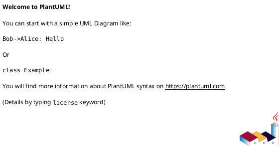

**Comments:**

- Single line: `' This is a comment`
- Block: `/' This is a block comment '/`

**Title and captions:**

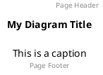

---

## Sequence Diagram Syntax

Sequence diagrams show interactions between participants.

### Participants

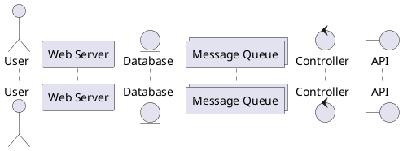

| Keyword | Shape |
| ------- | ----- |
| `participant` | Rectangle (default) |
| `actor` | Stick figure |
| `boundary` | Circle with line |
| `control` | Circle with arrow |
| `entity` | Circle with underline |
| `database` | Cylinder |
| `collections` | Stacked rectangles |
| `queue` | Queue shape |

### Arrow Types

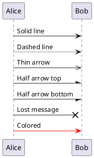

### Activation and Lifelines

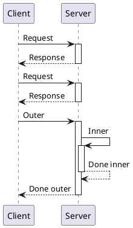

### Groups, Loops, and Alternatives

```plantuml
@startuml
participant User
participant API
participant DB

User -> API: Request

alt Success Case
    API -> DB: Query
    DB --> API: Data
    API --> User: 200 OK
else Failure Case
    API --> User: 500 Error
end

loop Every 5 seconds
    API -> DB: Health check
end

opt Optional Step
    API -> API: Log request
end

par Parallel Execution
    API -> Service1: Call 1
and
    API -> Service2: Call 2
end

critical Critical Section
    API -> DB: Transaction
end
@enduml
```

### Notes

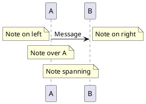

### Complete Sequence Example

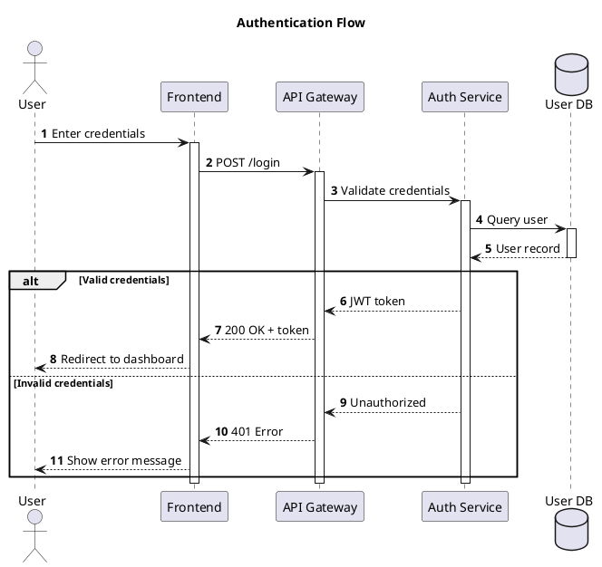

---

## Class Diagram Syntax

Class diagrams show object-oriented structures.

### Class Definition

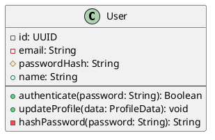

### Visibility Modifiers

| Symbol | Meaning |
| ------ | ------- |
| `-` | Private |
| `+` | Public |
| `#` | Protected |
| `~` | Package |

### Relationships

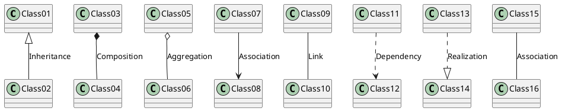

| Symbol | Relationship |
| ------ | ------------ |
| `<\|--` | Inheritance (extends) |
| `*--` | Composition (contains, lifecycle bound) |
| `o--` | Aggregation (contains, independent lifecycle) |
| `-->` | Association (uses) |
| `..>` | Dependency (uses temporarily) |
| `..\|>` | Realization (implements) |

### Cardinality

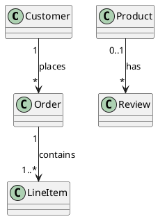

### Stereotypes and Notes

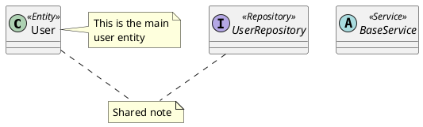

### Packages and Namespaces

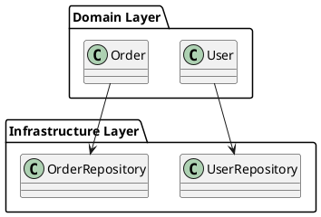

### Complete Class Example

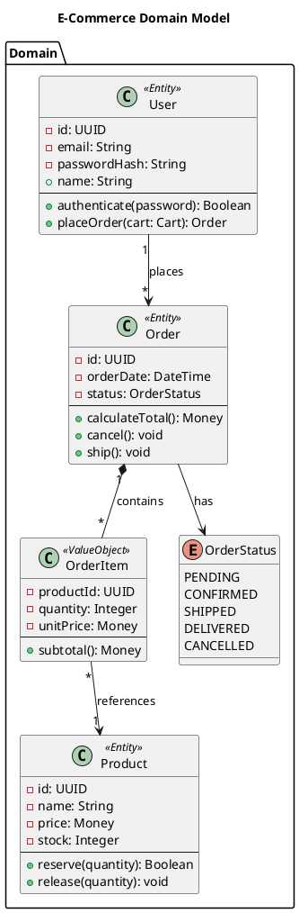

---

## Activity Diagram Syntax

Activity diagrams show workflows and processes.

### Basic Syntax

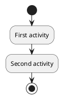

### Conditions

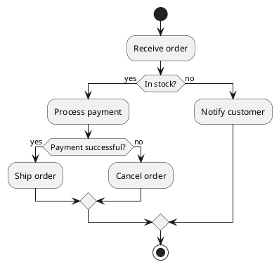

### Swimlanes

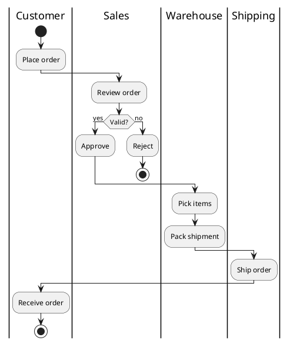

### Fork and Join

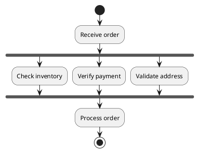

### Complete Activity Example

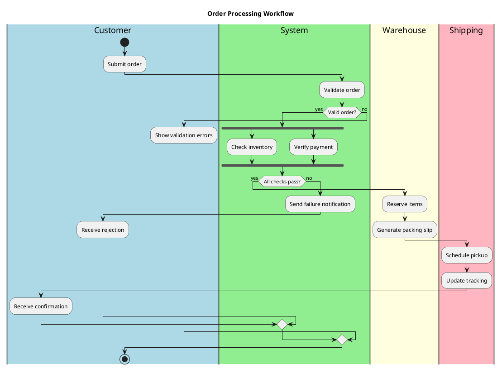

---

## State Diagram Syntax

State diagrams show state machines.

### Basic Syntax

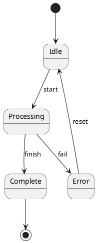

### Composite States

```plantuml
@startuml
[*] --> Active

state Active {
    [*] --> Running
    Running --> Paused : pause
    Paused --> Running : resume
    Running --> [*] : stop
}

Active --> Terminated : shutdown
Terminated --> [*]
@enduml
```

### Concurrent States

```plantuml
@startuml
[*] --> Active

state Active {
    state "Thread 1" as t1 {
        [*] --> Idle1
        Idle1 --> Running1
        Running1 --> Idle1
    }
    --
    state "Thread 2" as t2 {
        [*] --> Idle2
        Idle2 --> Running2
        Running2 --> Idle2
    }
}

Active --> [*]
@enduml
```

---

## Component Diagram Syntax

Component diagrams show system structure.

```plantuml
@startuml
package "Frontend" {
    [Web App] as webapp
    [Mobile App] as mobile
}

package "Backend" {
    [API Gateway] as api
    [Auth Service] as auth
    [Order Service] as order
    [User Service] as user
}

package "Data" {
    database "PostgreSQL" as db
    database "Redis" as cache
}

webapp --> api
mobile --> api
api --> auth
api --> order
api --> user
auth --> db
order --> db
user --> db
auth --> cache
@enduml
```

---

## Deployment Diagram Syntax

Deployment diagrams show infrastructure.

```plantuml
@startuml
node "Web Server" {
    [Nginx] as nginx
    [Node.js App] as app
}

node "Database Server" {
    database "PostgreSQL" as db
}

cloud "AWS" {
    [S3 Bucket] as s3
    [CloudFront] as cdn
}

nginx --> app
app --> db
app --> s3
cdn --> s3
@enduml
```

---

## C4 Model Diagrams

PlantUML has mature C4 support via includes.

### C4 Context Diagram

```plantuml
@startuml
!include https://raw.githubusercontent.com/plantuml-stdlib/C4-PlantUML/master/C4_Context.puml

title System Context Diagram

Person(user, "User", "A user of the system")
System(mySystem, "My System", "Main application")
System_Ext(email, "Email System", "Sends emails")
System_Ext(payment, "Payment Gateway", "Processes payments")

Rel(user, mySystem, "Uses")
Rel(mySystem, email, "Sends emails")
Rel(mySystem, payment, "Processes payments")
@enduml
```

### C4 Container Diagram

```plantuml
@startuml
!include https://raw.githubusercontent.com/plantuml-stdlib/C4-PlantUML/master/C4_Container.puml

title Container Diagram

Person(user, "User", "End user")

System_Boundary(boundary, "My System") {
    Container(web, "Web Application", "React", "User interface")
    Container(api, "API Server", "Node.js", "Business logic")
    ContainerDb(db, "Database", "PostgreSQL", "Stores data")
    Container(queue, "Message Queue", "RabbitMQ", "Async processing")
    Container(worker, "Background Worker", "Node.js", "Processes jobs")
}

Rel(user, web, "Uses", "HTTPS")
Rel(web, api, "API calls", "REST/JSON")
Rel(api, db, "Reads/Writes", "SQL")
Rel(api, queue, "Publishes", "AMQP")
Rel(worker, queue, "Consumes", "AMQP")
Rel(worker, db, "Updates", "SQL")
@enduml
```

### C4 Component Diagram

```plantuml
@startuml
!include https://raw.githubusercontent.com/plantuml-stdlib/C4-PlantUML/master/C4_Component.puml

title Component Diagram - API Server

Container_Boundary(api, "API Server") {
    Component(auth, "Auth Controller", "Express", "Handles authentication")
    Component(users, "User Controller", "Express", "User management")
    Component(orders, "Order Controller", "Express", "Order processing")
    Component(authService, "Auth Service", "TypeScript", "Authentication logic")
    Component(userService, "User Service", "TypeScript", "User business logic")
    Component(orderService, "Order Service", "TypeScript", "Order business logic")
    ComponentDb(userRepo, "User Repository", "TypeORM", "User data access")
    ComponentDb(orderRepo, "Order Repository", "TypeORM", "Order data access")
}

Rel(auth, authService, "Uses")
Rel(users, userService, "Uses")
Rel(orders, orderService, "Uses")
Rel(authService, userRepo, "Uses")
Rel(userService, userRepo, "Uses")
Rel(orderService, orderRepo, "Uses")
@enduml
```

---

## Entity Relationship Diagram

```plantuml
@startuml
entity User {
    * id : UUID <<PK>>
    --
    * email : String <<UK>>
    * password_hash : String
    name : String
    created_at : DateTime
}

entity Post {
    * id : UUID <<PK>>
    --
    * author_id : UUID <<FK>>
    * title : String
    content : Text
    status : String
    published_at : DateTime
}

entity Comment {
    * id : UUID <<PK>>
    --
    * post_id : UUID <<FK>>
    * user_id : UUID <<FK>>
    content : Text
    created_at : DateTime
}

entity Tag {
    * id : UUID <<PK>>
    --
    * name : String <<UK>>
}

entity PostTag {
    * post_id : UUID <<FK,PK>>
    * tag_id : UUID <<FK,PK>>
}

User ||--o{ Post : writes
User ||--o{ Comment : writes
Post ||--o{ Comment : has
Post ||--o{ PostTag : has
Tag ||--o{ PostTag : has
@enduml
```

---

## JSON Visualization

```plantuml
@startjson
{
    "user": {
        "id": "123",
        "name": "John Doe",
        "email": "john@example.com",
        "roles": ["admin", "user"],
        "profile": {
            "avatar": "https://example.com/avatar.png",
            "bio": "Software developer"
        }
    },
    "settings": {
        "theme": "dark",
        "notifications": true
    }
}
@endjson
```

---

## MindMap

```plantuml
@startmindmap
* Project
** Planning
*** Requirements
*** Design
*** Timeline
** Development
*** Backend
**** API
**** Database
*** Frontend
**** Components
**** Styling
** Testing
*** Unit Tests
*** Integration Tests
*** E2E Tests
** Deployment
*** Staging
*** Production
@endmindmap
```

---

## Gantt Chart

```plantuml
@startgantt
Project starts 2024-01-01
[Planning] lasts 14 days
[Design] lasts 21 days
[Design] starts at [Planning]'s end

[Backend Development] lasts 42 days
[Backend Development] starts at [Design]'s end

[Frontend Development] lasts 35 days
[Frontend Development] starts at [Design]'s end

[Integration] lasts 14 days
[Integration] starts at [Backend Development]'s end
[Integration] starts at [Frontend Development]'s end

[Testing] lasts 21 days
[Testing] starts at [Integration]'s end

[Deployment] lasts 7 days
[Deployment] starts at [Testing]'s end
@endgantt
```

---

## Styling and Themes

### Skinparams

```plantuml
@startuml
skinparam backgroundColor #EEEEEE
skinparam classFontColor #333333
skinparam classFontSize 14
skinparam classFontName Arial
skinparam classBackgroundColor #FFFFFF
skinparam classBorderColor #333333
skinparam classArrowColor #333333

class MyClass {
    +attribute: String
    +method(): void
}
@enduml
```

### Built-in Themes

```plantuml
@startuml
!theme cerulean
' Other themes: blueprint, plain, sketchy-outline, toy, vibrant

class Example
@enduml
```

### Custom Colors

```plantuml
@startuml
skinparam class {
    BackgroundColor<<Entity>> LightBlue
    BackgroundColor<<Service>> LightGreen
    BackgroundColor<<Repository>> LightYellow
}

class User <<Entity>>
class UserService <<Service>>
class UserRepository <<Repository>>
@enduml
```

---

## Setup Options

### Local Installation

1. **Install Java JRE** (required)
2. **Install GraphViz** (for some diagram types)
   - Windows: `choco install graphviz`
   - macOS: `brew install graphviz`
   - Linux: `apt install graphviz`
3. **Download PlantUML JAR** from plantuml.com
4. **Run:** `java -jar plantuml.jar diagram.puml`

### Docker (Recommended)

```bash
docker run -d -p 8080:8080 plantuml/plantuml-server:jetty
```

Access at: <http://localhost:8080>

### VS Code Extension

Install "PlantUML" extension, configure server URL in settings:

```json
{
    "plantuml.server": "http://localhost:8080"
}
```

---

## File Extensions

| Extension | Description |
| --------- | ----------- |
| `.puml` | Standard PlantUML file |
| `.plantuml` | Alternative extension |
| `.pu` | Short extension |
| `.iuml` | Include file |

---

## Quick Reference Card

### Sequence

```plantuml
@startuml
participant A
participant B
A -> B: Message
A <-- B: Response
@enduml
```

### Class

```plantuml
@startuml
class Name {
    - private
    + public
    + method()
}
A <|-- B : extends
A *-- B : contains
@enduml
```

### Activity

```plantuml
@startuml
start
:Action;
if (condition?) then (yes)
    :True path;
else (no)
    :False path;
endif
stop
@enduml
```

### State

```plantuml
@startuml
[*] --> State1
State1 --> State2 : event
State2 --> [*]
@enduml
```

### Component

```plantuml
@startuml
[Component1] --> [Component2]
database DB
Component2 --> DB
@enduml
```

### C4

```plantuml
@startuml
!include C4_Context.puml
Person(user, "User")
System(sys, "System")
Rel(user, sys, "Uses")
@enduml
```

### ER

```plantuml
@startuml
entity User {
    * id : UUID <<PK>>
    --
    * email : String <<UK>>
}
entity Post {
    * id : UUID <<PK>>
    * author_id : UUID <<FK>>
}
User ||--o{ Post : writes
@enduml
```

### JSON

```plantuml
@startjson
{
    "key": "value",
    "array": [1, 2, 3]
}
@endjson
```

### MindMap

```plantuml
@startmindmap
* Root
** Branch 1
*** Leaf
** Branch 2
@endmindmap
```

### Gantt

```plantuml
@startgantt
[Task 1] lasts 10 days
[Task 2] starts at [Task 1]'s end
[Task 2] lasts 5 days
@endgantt
```

---

**Last Updated:** 2025-12-06
**PlantUML Version:** 1.2024.x
